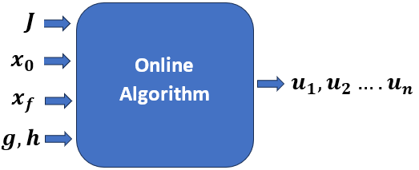
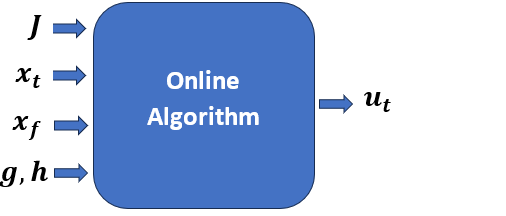

# Introduction

## Trajectory Optimization

Trajectory optimization is a branch of optimal control that focuses on finding the best possible trajectory, which is a time-parameterized path of states and control inputs, for a non-autonomous system to achieve a desired objective. The problem is formulated as an optimization task, where a *cost function* (also called a performance index) is minimized or maximized. This cost function can represent fuel consumption, time, energy, or any other measurable criterion critical to system performance.

The decision variables in trajectory optimization include the system's states (such as position, velocity, or orientation) and control inputs (such as thrust, torque, or steering angle), which evolve over a defined time horizon. The system dynamics, governed by ordinary differential equations (ODEs), form the dynamic constraints, ensuring that the solution respects the laws of physics. Additionally, path constraints and boundary conditions restrict states and controls within safe or feasible bounds, such as actuator limits or desired final states.

The optimization problem is often solved numerically using either direct methods (for example, collocation or direct shooting), which discretize the trajectory, or indirect methods, which derive necessary conditions for optimality through the calculus of variations and solve the resulting two-point boundary value problem (TPBVP). The optimal control policy must be generated by satisfying all constraints and conditions that minimize the objective function.

## General Trajectory Optimization Problem

Trajectory optimization problems can take various forms depending on the system's nature and performance objectives. In this thesis, the focus is limited to continuous-time, single-phase problems where the system evolves smoothly without any discontinuities in its dynamics. Although more complex formulations, such as those involving multiple segments or hybrid systems with discrete transitions, they are outside the scope of this work.

A general trajectory optimization objective may comprise two components: a boundary term, represented by $J(\cdot)$, which captures conditions at the initial and final time points, and an integral term, represented by $w(\cdot)$, which accumulates cost over the entire trajectory duration. When both terms are included, the problem is said to be in Bolza form. If only the integral term is present, it is referred to as the Lagrange form, while a formulation with only the boundary term is known as the Mayer form.

The optimization is performed over a finite time interval, with time $t \in [t_0, t_f]$, where $t_0$ and $t_f$ denote the initial and final times, respectively. The general objective function in Bolza form is expressed as:

$$
\min_{t_0, t_f, \mathbf{x}(t), \mathbf{u}(t)} J(t_0, t_f, \mathbf{x}(t_0), \mathbf{x}(t_f)) + \int_{t_0}^{t_f} w(\tau, \mathbf{x}(\tau), \mathbf{u}(\tau)) \, d\tau.
$$ {#eq-bolza}

Here, the decision variables include the initial and final times $t_0, t_f$, as well as the state trajectory $\mathbf{x}(t)$ and the control trajectory $\mathbf{u}(t)$. To ensure feasibility, various constraints are imposed on these variables.

System dynamics are defined as

$$
\dot{\mathbf{x}}(t) = \mathbf{f}(t, \mathbf{x}(t), \mathbf{u}(t))
$$ {#eq-dynamics}

Path constraints restrict the trajectory within specified bounds:

$$
\mathbf{h}(t, \mathbf{x}(t), \mathbf{u}(t)) \leq 0
$$ {#eq-path-constraints}

Boundary constraints enforce conditions at the start and end points:

$$
\mathbf{g}(t_0, t_F, \mathbf{x}(t_0), \mathbf{x}(t_f)) \leq 0.
$$ {#eq-boundary-constraints}

State, control, and time bounds ensure the solution lies within feasible ranges:

$$
\mathbf{x}_\text{low} \leq \mathbf{x}(t) \leq \mathbf{x}_\text{upp}, \quad 
\mathbf{u}_\text{low} \leq \mathbf{u}(t) \leq \mathbf{u}_\text{upp}, \quad 
t_\text{low} \leq t_0 < t_f \leq t_\text{upp}.
$$ {#eq-bounds}

Initial and final state bounds specify limits at the boundaries:

$$
\mathbf{x}_{0,\text{low}} \leq \mathbf{x}(t_0) \leq \mathbf{x}_{0,\text{upp}}, \quad 
\mathbf{x}_{f,\text{low}} \leq \mathbf{x}(t_f) \leq \mathbf{x}_{f,\text{upp}}.
$$ {#eq-initial-final-bounds}

This formulation is suitable for single-phase, continuous-time problems, focusing on cases expressed in Lagrange form, where only the integral term is present in the objective function.

## Modes of Trajectory Optimization

Trajectory optimization problems can be addressed in two primary modes: offline and online. In the offline mode, the trajectory is computed before the actual operation of the system, under the assumption of complete knowledge of the system dynamics, environment, and control model. This mode enables complex and accurate optimization, often with high computational resources. However, it lacks adaptability and becomes suboptimal when unexpected changes or uncertainties occur during operation.

The online mode, in contrast, refers to computing or updating the trajectory in real time during the system's operation. This is particularly important in the presence of uncertainties, which may arise from disturbances in the environment, inaccuracies in the system model, or unmodeled control behavior. Due to the need for rapid computation, online algorithms prioritize responsiveness over absolute accuracy.

Since offline and online modes each offer distinct advantages and limitations, a hybrid approach is often employed. In this mode, an initial trajectory is generated offline based on nominal conditions and later refined online using real-time state feedback. This allows for a balance between computational efficiency and adaptability. Deep Neural Networks (DNNs) are commonly used in such frameworks due to their ability to generalize from offline training data and adapt quickly during online execution.

In real-world scenarios, relying solely on precomputed offline trajectories without incorporating state feedback can result in degraded performance under uncertainty. Online trajectory optimization compensates for these deviations by continuously adjusting control inputs based on the actual system state. Specifically, it aims to compute the optimal control given the current state, thereby enhancing robustness and ensuring the system operates effectively in dynamic environments. The general structure of such algorithms is illustrated in @fig-modes.

::: {#fig-modes layout-ncol=2}
{#fig-offline}

{#fig-online}

Modes of Trajectory Optimization
:::

Looking at aerospace applications, and in particular, retro-propulsive launch vehicle landing and reaction wheel spacecraft attitude control, the uncertainties are unavoidable because of the complexity of the underlying systems and the diversity of the environments under which these systems operate.

### Algorithms

Keeping in mind the diverse applications of trajectory optimization, and the conflicting requirements of accuracy and speed, a variety of algorithms have been developed to solve the trajectory optimization problem. These algorithms can be broadly classified into two categories: direct and indirect methods.

In trajectory optimization, direct methods are commonly used to convert continuous-time problems into nonlinear programming problems. Approaches like shooting methods, Hermite-Simpson collocation, and pseudospectral methods differ in how they handle dynamics and discretization. While shooting methods can struggle with stability over long horizons, collocation and pseudospectral methods offer improved robustness.

However, the indirect method requires solving a TPBVPs for both the state and costate ODEs, which poses significant challenges due to the need for precise boundary conditions. This limitation highlights the potential of DNNs, which offer a robust alternative by directly solving these ODEs even with partial or incomplete boundary information, thereby simplifying the process and expanding the envelope of solvable problems at the expense of higher computing.

## Deep Neural Networks

Machine Learning (ML) is a subset of artificial intelligence that focuses on enabling systems to learn and adapt from data without explicit programming. By leveraging algorithms to identify patterns and optimize representations of input data within a defined space, ML provides solutions to complex problems across various domains. The process is guided by feedback signals, enabling systems to refine their performance iteratively. This methodology has been successfully applied to challenging tasks such as speech recognition, autonomous navigation, and predictive modeling, demonstrating its ability to address specialized, data-driven challenges in diverse fields. A conceptual relationship among artificial intelligence, machine learning, and deep learning is illustrated in @fig-ai-ml-dl.

The definition given by Prof. Tom Mitchell is: "A computer program is said to learn from experience $E$ with respect to some task $T$ and some performance measure $P$, if its performance on $T$, as measured by $P$, improves with experience $E$" [@chollet2021deep].

![Artificial intelligence, machine learning, and deep learning [@chollet2021deep]](Chapter1_imgs/c1.PNG){#fig-ai-ml-dl width="60%"}

Deep learning is a specialized subfield of machine learning that focuses on learning hierarchical layers of representations from data. Unlike traditional machine learning approaches, which typically learn one or two layers of representations, deep learning involves multiple layers that progressively capture more meaningful features. These layers are learned automatically from training data, and the depth of the model refers to the number of layers. Modern deep learning models, often implemented using neural networks, can have tens or even hundreds of layers. Despite the term "neural network" being inspired by neurobiology, deep learning models are not directly related to the brain's structure or learning mechanisms. Instead, they serve as mathematical frameworks for learning complex representations from data. A typical architecture of a DNN is shown in @fig-dnn-architecture, illustrating how layers of neurons are stacked to form the model.

![A typical Deep Neural Network (DNN) architecture showing multiple layers of neurons [@dnn2023]](Chapter1_imgs/c2.PNG){#fig-dnn-architecture width="60%"}

Since this thesis spans the complete development and application of various trajectory optimization techniques, ranging from classical numerical methods to modern deep learning approaches, literature reviews are integrated contextually at the beginning of each relevant chapter. For instance, Chapter 2 reviews traditional direct and indirect methods used in trajectory optimization, while Chapter 3 explores recent advances in Physics-Informed Neural Networks (PINNs) for solving optimal control problems. Chapter 4 introduces the Theory of Functional Connections (TFC), preceded by a review of boundary value problem-solving methods. Each of these reviews is presented just before the core technical content to ensure clarity and relevance.

The following section outlines the structure of the thesis and summarizes the contributions made in each chapter. This overview is intended to guide the reader through the logical flow of the work and emphasize the novel aspects of the research.

### Outline of the Thesis {.unnumbered}

Chapter 2 presents a comprehensive review of both direct and indirect methods for solving trajectory optimization problems. It begins with discretization techniques such as the trapezoidal and Hermite–Simpson methods, which are applied to the Linear Tangent Steering (LTS) problem. The chapter also examines the use of regularization strategies to suppress chattering in control signals. Limitations of direct methods are discussed, followed by a theoretical introduction to indirect approaches based on the Pontryagin Maximum Principle.

Chapter 3 focuses on the application of Physics-Informed Neural Networks (PINNs) for solving optimal control problems. It details the structure and training of PINNs, emphasizing their capability to simultaneously learn both state and costate trajectories. The performance of various activation functions, particularly the Rowdy Adaptive Activation Function (RAAF), is assessed. Additionally, techniques such as weight initialization and interpolation are explored to improve training stability and convergence.

Chapter 4 introduces the Theory of Functional Connections (TFC) as a powerful method for solving boundary value problems in trajectory optimization. The mathematical foundations of TFC are presented, and its application to problems such as energy-optimal planetary landing is demonstrated. The chapter highlights TFC's ability to analytically satisfy boundary conditions and handle state and control constraints with high accuracy.

Finally, Chapter 5 summarizes the key contributions of the thesis and compares classical numerical methods with learning-based approaches for trajectory optimization. The strengths and limitations of each method are discussed, along with potential directions for future work, including real-time implementation, adaptive control strategies, and hybrid frameworks that integrate physics-based models with data-driven techniques.