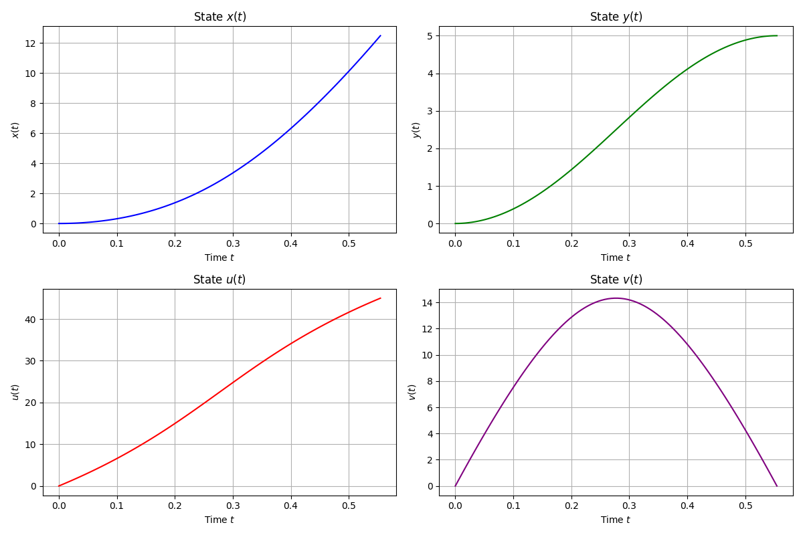
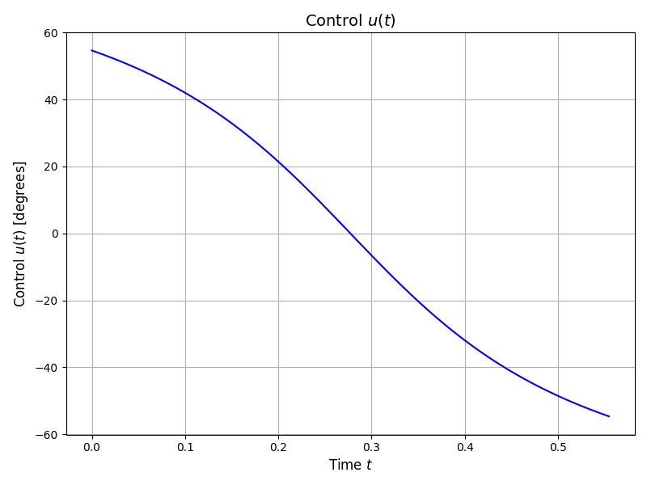
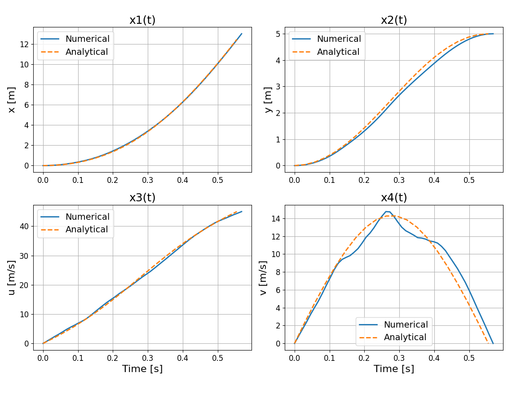
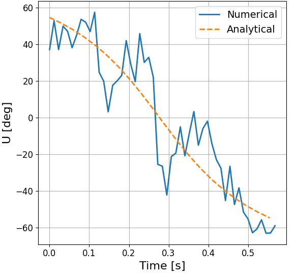
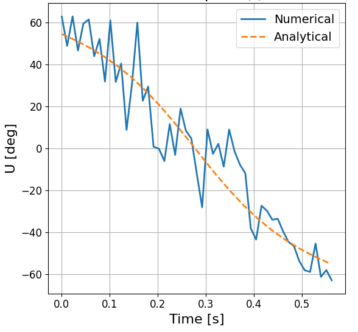
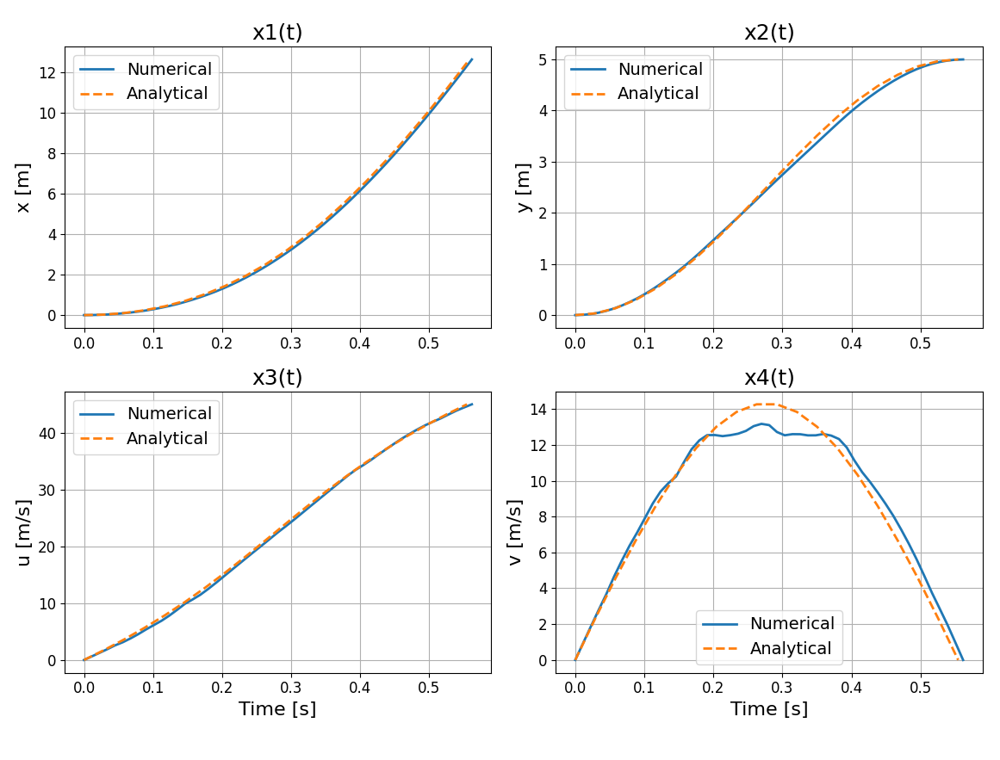
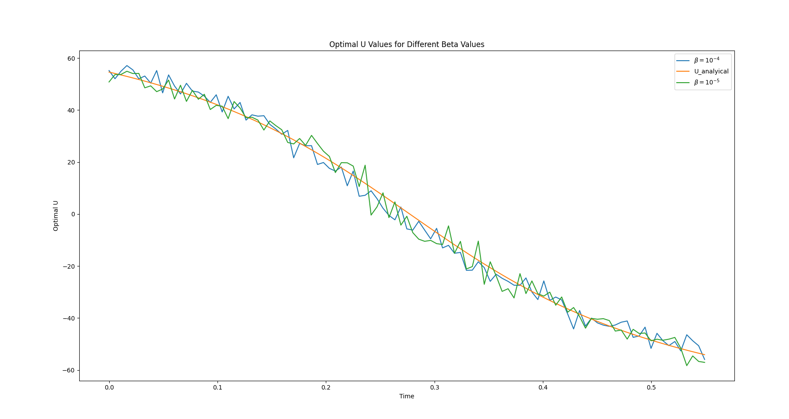
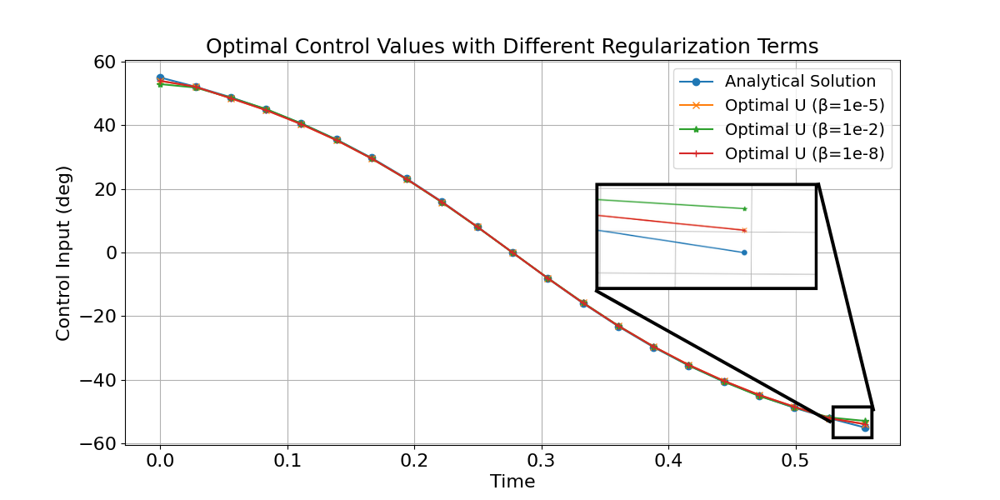
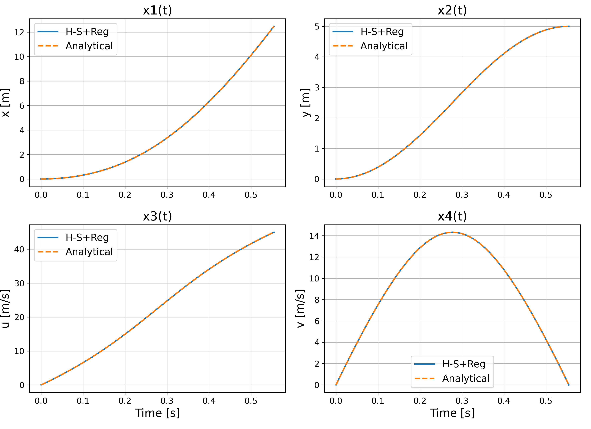
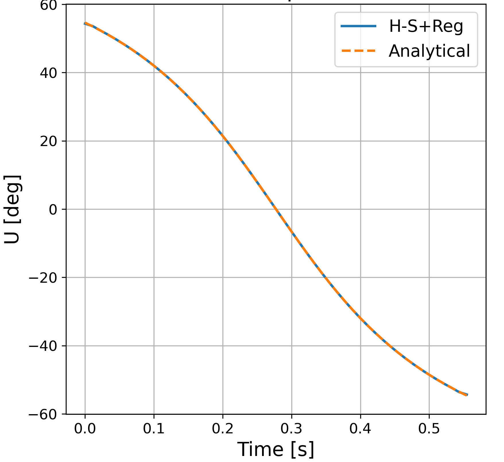

# General Methods to Solve Trajectory Optimization Problem

During the course of this research, a thorough investigation of direct methods for optimal control is undertaken, with a focus on their formulation and application to dynamic systems. The effectiveness of these methods is critically assessed, followed by an exploration of potential enhancements to improve solution accuracy and computational efficiency. Specifically, the study examines various discretization schemes, such as the Trapezoidal and Hermite-Simpson methods, and investigates how modifications in the formulation, including the introduction of regularization terms, can reduce computational errors and yield more optimal trajectories.

## Direct Method

Direct methods for solving optimal control problems (OCPs) involve transcribing the continuous-time problem into a finite-dimensional nonlinear programming problem (NLP). This is achieved by discretizing the time horizon and approximating both the system dynamics and the cost functional at discrete time points.

Several transcription techniques are used in direct methods, each differing in the way they discretize the dynamics and integrate the cost. This thesis considers two widely used collocation-based techniques: the Trapezoidal method and the Hermite–Simpson method. The Trapezoidal method is a second-order accurate scheme known for its simplicity, while the Hermite–Simpson method offers higher (third-order) accuracy by incorporating midpoint information through Hermite interpolation and Simpson's integration rule.

The following subsections describe these methods in detail.

### Trapezoidal Method

The trapezoidal method is a collocation-based discretization scheme that approximates the dynamics of the system using a second-order accurate rule. It converts the continuous-time OCPs into an NLP by enforcing dynamic constraints at discrete time intervals.

As introduced in Chapter 1, we consider a OCP with a Lagrange-type cost functional:

$$
\min_{\mathbf{x}(t), \mathbf{u}(t)} \int_{t_0}^{t_f} w(\mathbf{x}(t), \mathbf{u}(t), t) \, dt,
$$ {#eq-ch2-continuous-cost}

To solve this problem using direct transcription, we apply the trapezoidal method to discretize both the objective and the dynamics over a uniform time grid. The time interval $[t_0, t_f]$ is divided into $N$ segments, with grid points $t_0, t_1, \ldots, t_N$, where $\Delta t = \frac{t_f - t_0}{N}$ and $t_k = t_0 + k \Delta t$.

The integral cost functional is approximated as:

$$
\min_{\{\mathbf{x}_k, \mathbf{u}_k\}} \sum_{k=0}^{N-1} w(\mathbf{x}_k, \mathbf{u}_k, t_k) \Delta t.
$$ {#eq-ch2-discrete-cost}

The system dynamics are enforced using the trapezoidal rule, resulting in the collocation constraint:

$$
\mathbf{x}_{k+1} - \mathbf{x}_k - \frac{\Delta t}{2} \left[ \mathbf{f}(\mathbf{x}_k, \mathbf{u}_k, t_k) + \mathbf{f}(\mathbf{x}_{k+1}, \mathbf{u}_{k+1}, t_{k+1}) \right] = 0
$$ {#eq-ch2-dyn-constraint}

This discretized optimization problem is also subject to the following constraints:

$$
\mathbf{x}_0 = \mathbf{x}(t_0), \quad \mathbf{x}_N = \mathbf{x}(t_f)
$$ {#eq-ch2-boundary-conditions}

$$
\mathbf{h}(\mathbf{x}_k, \mathbf{u}_k, t_k) \leq \mathbf{0}, \quad \text{for } k = 0, \dots, N-1
$$ {#eq-ch2-path-constraints}

$$
\mathbf{u}_{\min} \leq \mathbf{u}_k \leq \mathbf{u}_{\max}, \quad \mathbf{x}_{\min} \leq \mathbf{x}_k \leq \mathbf{x}_{\max}
$$ {#eq-ch2-bounds}

The result is a finite-dimensional NLP that can be efficiently solved using standard numerical optimization techniques, where the decision variables are the discretized state and control trajectories $\{ \mathbf{x}_k, \mathbf{u}_k \}$.

### Hermite–Simpson Method

The Hermite–Simpson (H-S) method is a third-order accurate direct collocation scheme used for solving OCPs. It combines Hermite interpolation and Simpson's rule to discretize both the dynamics and the cost functional over a uniform time grid, allowing better approximation of the system behavior between nodes.

We consider a continuous-time OCP with a Lagrange-type cost functional:

$$
\min_{\mathbf{x}(t), \mathbf{u}(t)} \int_{t_0}^{t_f} w(\mathbf{x}(t), \mathbf{u}(t), t) \, dt,
$$ {#eq-ch2-hs-cont-cost}

The time interval $[t_0, t_f]$ is divided into $N$ uniform segments with grid points $t_0, t_1, \ldots, t_N$, and step size $\Delta t = \frac{t_f - t_0}{N}$. Midpoints are defined as $t_m = \frac{t_k + t_{k+1}}{2}$.

Using Simpson's rule, the discretized cost functional becomes:

$$
\min_{\{\mathbf{x}_k, \mathbf{u}_k\}} \sum_{k=0}^{N-1} \frac{\Delta t}{6} \left[ w(\mathbf{x}_k, \mathbf{u}_k, t_k) + 4 w(\mathbf{x}_m, \mathbf{u}_m, t_m) + w(\mathbf{x}_{k+1}, \mathbf{u}_{k+1}, t_{k+1}) \right]
$$ {#eq-ch2-hs-disc-cost}

where $\mathbf{x}_m$ and $\mathbf{u}_m$ are midpoint estimates between $t_k$ and $t_{k+1}$.

The system dynamics are enforced using the H-S collocation constraint:

$$
\mathbf{x}_{k+1} = \mathbf{x}_k + \frac{\Delta t}{6} \left[ \mathbf{f}(\mathbf{x}_k, \mathbf{u}_k) + 4 \mathbf{f}(\mathbf{x}_m, \mathbf{u}_m) + \mathbf{f}(\mathbf{x}_{k+1}, \mathbf{u}_{k+1}) \right]
$$ {#eq-ch2-hs-dynamics}

The midpoint state $\mathbf{x}_m$ is approximated as:

$$
\mathbf{x}_m = \frac{1}{2}(\mathbf{x}_k + \mathbf{x}_{k+1}) + \frac{\Delta t}{8} \left[ \mathbf{f}(\mathbf{x}_k, \mathbf{u}_k) - \mathbf{f}(\mathbf{x}_{k+1}, \mathbf{u}_{k+1}) \right]
$$ {#eq-ch2-hs-xm}

The full H-S transcription includes the following constraints:

$$
\mathbf{x}_0 = \mathbf{x}(t_0), \quad \mathbf{x}_N = \mathbf{x}(t_f)
$$ {#eq-ch2-hs-bc}

$$
\mathbf{h}(\mathbf{x}_k, \mathbf{u}_k) \leq \mathbf{0}, \quad \text{for } k = 0, \dots, N
$$ {#eq-ch2-hs-path}

$$
\mathbf{u}_{\min} \leq \mathbf{u}_k \leq \mathbf{u}_{\max}, \quad \mathbf{x}_{\min} \leq \mathbf{x}_k \leq \mathbf{x}_{\max}
$$ {#eq-ch2-hs-bounds}

The H-S method achieves higher-order accuracy compared to lower-order schemes like the trapezoidal method by incorporating interpolated midpoints in both the cost and dynamic constraints. This enhanced accuracy makes it especially effective in problems with nonlinear or rapidly varying dynamics.

### Linear Tangent Steering Problem {#sec-ch2-lts}

The Linear Tangent Steering (LTS) problem [@bryson2018applied] is a classical optimal control problem that involves steering a system governed by nonlinear dynamics to a specified final state while minimizing the total control time. It serves as a standard benchmark for testing the performance of numerical optimization techniques.

The objective is to minimize the total time $t_f$ required to reach a desired final position from a given initial condition:

$$
J = \int_0^{t_f} 1 \, dt = t_f
$$ {#eq-ch2-lts-obj}

#### Dynamic Constraints

The system is defined by four states: $x_1$ and $x_2$ (position components), and $x_3$, $x_4$ (velocity components). The dynamics are governed by the following equations:

$$
\begin{aligned}
    \dot{x}_1 &= x_3, \\
    \dot{x}_2 &= x_4, \\
    \dot{x}_3 &= a \cos u, \\
    \dot{x}_4 &= a \sin u,
\end{aligned}
$$ {#eq-ch2-lts-dynamics}

where $a$ is a constant acceleration magnitude, and $u(t)$ is the control input representing the steering angle.

#### Boundary Conditions

The problem is subject to the following initial and terminal boundary conditions:

$$
\begin{aligned}
    x_1(0) &= 0, &\quad x_1(t_f) &= \text{free}, \\
    x_2(0) &= 0, &\quad x_2(t_f) &= 5, \\
    x_3(0) &= 0, &\quad x_3(t_f) &= 45, \\
    x_4(0) &= 0, &\quad x_4(t_f) &= 0.
\end{aligned}
$$ {#eq-ch2-lts-bc}

The analytical solution to this problem is obtained by solving the necessary conditions of optimality, derived using the Pontryagin Maximum Principle (PMP). These conditions include the state and costate dynamics as well as transversality conditions and yield an exact trajectory that satisfies all constraints.

@fig-ch2-lts-solution shows the analytical solution for the state variables and control input over the optimal trajectory. The optimized final time is found to be $t_f = 0.5546 \, \text{s}$, which serves as a benchmark for evaluating numerical methods.

::: {#fig-ch2-lts-solution layout-ncol=2}
{#fig-ch2-lts-states}

{#fig-ch2-lts-control}

Analytical solution
:::

This analytical solution, derived without numerical approximations, provides a valuable reference for assessing the accuracy and convergence of transcription-based methods such as the Hermite–Simpson method. For detailed derivations and analytical formulations, refer to [@bryson2018applied].

While the analytical solution offers exact results for this benchmark problem, it is not always feasible for more complex systems or constraints. Therefore, a numerical optimization approach is employed to approximate the optimal trajectory using transcription techniques, which can be generalized to a broader class of problems.

#### Numerical Optimization Setup

To numerically solve the LTS problem, the continuous-time optimal control problem is transcribed into a finite-dimensional NLP problem using direct collocation methods. The resulting NLP is solved using the Sequential Least Squares Quadratic Programming (SLSQP) algorithm, implemented via the `scipy.optimize.minimize` function in Python.

The optimization procedure minimizes the cost functional while ensuring that the discretized dynamics, boundary conditions, and path constraints are satisfied at all collocation points. The discretized design variables of state vectors, control inputs, and the final time $t_f$ across $N+1$ nodes is given below:

$$
\left[ \tilde{\mathbf{x}}_1,\, \tilde{\mathbf{x}}_2,\, \tilde{\mathbf{x}}_3,\, \tilde{\mathbf{x}}_4,\, \tilde{\mathbf{u}},\, t_f \right]
$$ {#eq-ch2-design-variables}

Here $\tilde{\mathbf{x}}_1$ represents the discretized $\mathbf{x_1}$, and the same applies for the other variables.

**Initial Guess:**
A well-chosen initial guess is essential to ensure the convergence of gradient-based optimization algorithms, particularly in problems involving nonlinear dynamics and constraints. The initial guess vector is constructed by concatenating the discretized design variables are given as below:

$$
\text{Initial Guess} =
\begin{cases}
\text{Linearly interpolated over the interval } [0, 5] & \text{for } \tilde{\mathbf{x}}_1,\, \tilde{\mathbf{x}}_2, \\
\text{Linearly spaced from } 0 \text{ to } 45 & \text{for } \tilde{\mathbf{x}}_3, \\
0 & \text{for } \tilde{\mathbf{x}}_4, \\
\text{Linearly spaced from } -1 \text{ to } 1 & \text{for } \tilde{\mathbf{u}}, \\
1.0 & \text{for } t_f.
\end{cases}
$$ {#eq-ch2-initial-guess}

**Bounds:**
To ensure that the optimization remains within feasible and physically meaningful limits, bounds are imposed on the decision variables:

$$
\text{bounds} =
\begin{cases}
[0, \infty) & \text{for } \tilde{\mathbf{x}}_1, \tilde{\mathbf{x}}_2, \tilde{\mathbf{x}}_3, t_f, \\
(-\infty, \infty) & \text{for } \mathbf{\tilde{x}}_4, \\
[-1.1, 1.1] & \text{for } \mathbf{\tilde{u}}.
\end{cases}
$$ {#eq-ch2-bounds-setup}

These bounds ensure, for example, that horizontal positions and velocities remain non-negative, while vertical velocities are unrestricted. The control inputs are slightly relaxed beyond the actual bounds $[-1, 1]$ to improve solver robustness and prevent premature clipping due to numerical rounding.

**Solver Settings:**
The optimization solver is configured with specific parameters to ensure robust and accurate convergence. The `SLSQP` (Sequential Least Squares Quadratic Programming) algorithm is employed as the optimization method. A high maximum iteration limit is set via `maxiter=10000`, providing ample opportunity for convergence. The gradient tolerance is configured with `gtol=1e-10`, ensuring that the solution satisfies the first-order optimality condition with high precision. Additionally, `disp=True` enables real-time display of the solver's progress and convergence messages. These settings collectively help balance computational cost and accuracy, which is crucial for problems involving sensitive dynamic constraints and tight boundary conditions.

### Solution using Trapezoidal Method

Following the numerical setup, the transcribed NLP is solved using the trapezoidal collocation method. The solver returns the optimal control $\tilde{\mathbf{u}}$, the corresponding state trajectories $\tilde{\mathbf{x}}_1, \tilde{\mathbf{x}}_2, \tilde{\mathbf{x}}_3, \tilde{\mathbf{x}}_4$, and the optimal final time $t_f$.

The results obtained are compared against the analytical solution to evaluate the performance of the trapezoidal method. @fig-ch2-trap-solution shows the control and state trajectories computed using the trapezoidal method.

The optimal control law in the LTS problem has a smooth bang-bang structure, featuring smooth transitions between maximum and minimum control values. However, the trapezoidal method fails to accurately capture these transitions, leading to artificial oscillations known as chattering. This effect is clearly visible in @fig-ch2-trap-control, where the control input fluctuates excessively around the expected switching points.

::: {#fig-ch2-trap-solution layout-ncol=2}
{#fig-ch2-trap-state}

{#fig-ch2-trap-control}

Numerical solution of the LTS problem using the trapezoidal method.
:::

To quantify the numerical error, the Mean Squared Error (MSE) between the trapezoidal and analytical solutions is computed for each state variable and the control input. Let $x^{\text{num}}(t)$ and $x^{\text{ref}}(t)$ represent the numerical and analytical solutions, respectively. Then,

$$
\text{MSE}(x_i) = \frac{1}{N+1} \sum_{k=0}^{N} \left( x_{i,k}^{\text{num}} - x_{i,k}^{\text{ref}} \right)^2
$$ {#eq-ch2-mse-trap}

| Quantity | Value |
|:---------|------:|
| $\text{MSE}(x_1)$ | $7.8471 \times 10^{-2}$ |
| $\text{MSE}(x_2)$ | $3.5940 \times 10^{-3}$ |
| $\text{MSE}(x_3)$ | $3.0631 \times 10^{-1}$ |
| $\text{MSE}(x_4)$ | $5.3473 \times 10^{-1}$ |
| $\text{MSE}(u)$ | $2.3736 \times 10^{2}$ |
| $t_f^{\text{num}}$ | $0.56822 \, \text{s}$ |
| $\varepsilon_{t_f}$ | $1.3653 \times 10^{-2} \, \text{s}$ |

: Computed MSE values and final time comparison {#tbl-ch2-mse-trap}

While the state and control trajectories broadly follow the expected profiles, the noticeable discrepancies, particularly in the control input, highlight the limitations of the trapezoidal method.

To address these limitations, the next section introduces the H-S method offers significantly improved accuracy. This higher-order method is better suited for resolving discontinuities in optimal control problems, including those with bang-bang control structures.

### Solution using Hermite–Simpson Method

To improve the accuracy and reduce the numerical artifacts observed with the trapezoidal method, the same trajectory optimization problem is now solved using the Hermite–Simpson collocation method. This third-order scheme incorporates midpoint information to more accurately approximate the system dynamics and cost function.

The optimization setup, including variable initialization, bounds, and solver configuration, remains consistent with the previous method. The numerical solution returns the optimized state trajectories $\tilde{\mathbf{x}}_1, \tilde{\mathbf{x}}_2, \tilde{\mathbf{x}}_3, \tilde{\mathbf{x}}_4$, the control input $\tilde{\mathbf{u}}$, and the final time $t_f$.

@fig-ch2-hs-solution presents the computed state and control trajectories. The left panel (@fig-ch2-hs-state) shows the state variables, while the right panel (@fig-ch2-hs-control) displays the control input profile.

Despite using a higher-order collocation method, the control input $\tilde{\mathbf{u}}$ still exhibits noticeable chattering, as seen in @fig-ch2-hs-control. This behavior stems from the nature of the optimal control law in this problem, which is a smooth bang-bang type. The smooth transitions between maximum and minimum control values pose challenges for numerical methods based on polynomial approximations, even those of higher order.

The persistence of chattering highlights a fundamental limitation in transcription-based methods: the inability to exactly represent the control signal. The H-S method captures the overall control structure more accurately than the trapezoidal method, but still struggles to eliminate chattering completely.

::: {#fig-ch2-hs-solution layout-ncol=2}
{#fig-ch2-hs-state}

{#fig-ch2-hs-control}

Numerical solution of the LTS problem using the H-S method.
:::

Similar to last method, MSE is computed for each state variable and the control input and, error in the final time.

| Quantity | Value |
|:---------|------:|
| $\text{MSE}(x_1)$ | $3.6200 \times 10^{-3}$ |
| $\text{MSE}(x_2)$ | $1.9110 \times 10^{-3}$ |
| $\text{MSE}(x_3)$ | $8.6762 \times 10^{-2}$ |
| $\text{MSE}(x_4)$ | $4.5058 \times 10^{-1}$ |
| $\text{MSE}(u)$ | $1.6727 \times 10^{2}$ |
| $t_f^{\text{num}}$ | $0.5617 \, \text{s}$ |
| $\varepsilon_{t_f}$ | $7.1137 \times 10^{-3} \, \text{s}$ |

: Computed MSE values and final time comparison using the Hermite–Simpson method {#tbl-ch2-mse-hs}

To alleviate this issue and promote smoother control profiles, a regularization term can be added to the cost functional. This term penalizes the rate of change in the control input and helps suppress high-frequency oscillations, thereby improving numerical stability and producing more realistic control behavior.

## Regularization Methods

To promote smoother control profiles and mitigate undesirable oscillations (chattering) in control inputs, a regularization term [@sanchez2016optimal] is often added to the objective function. This term penalizes large variations in the control trajectory by discouraging abrupt changes in the derivative of the control vector $\mathbf{\tilde{u}}$. Such an approach is particularly useful in trajectory optimization problems, where noisy or highly oscillatory controls can be both unrealistic and numerically unstable.

The regularization cost is computed using a second-order finite difference approximation of the first derivative of the control input. Note that the time step $\Delta t$ is omitted from the formulation.

**Regularization Term**

A central difference approximation is used for all interior nodes $i = 0, \dots, N$:

$$
R(\mathbf{\tilde{u}}) = \sum_{i=0}^{N} \left( \frac{\mathbf{{u}}_{i+1} - \mathbf{u}_{i-1}}{2} \right)^2
$$ {#eq-ch2-central-diff-reg}

**Boundary Approximations**

At the boundaries where central differences are not applicable, second-order forward and backward differences are used:

$$
\text{First Point } (i = 0): \quad \left( \frac{-3\mathbf{u}_0 + 4\mathbf{u}_1 - \mathbf{u}_2}{2} \right)^2
$$ {#eq-ch2-forward-diff}

$$
\text{Last Point } (i = N): \quad \left( \frac{3\mathbf{u}_{N} - 4\mathbf{u}_N + \mathbf{u}_{N-1}}{2} \right)^2
$$ {#eq-ch2-backward-diff}

**Regularized Objective Function**

The modified objective function incorporating the regularization term is:

$$
J' = J + \beta R(\mathbf{\tilde{u}})
$$ {#eq-ch2-reg-objective}

where $J$ is the original objective function (e.g., final time or control effort), $R(\mathbf{\tilde{u}})$ is the regularization term, and $\beta$ is a user-defined weighting parameter that balances optimality and smoothness.

Including this regularization term reduces high-frequency content in the control signal $\mathbf{u}$, thereby suppressing chattering and enhancing the numerical stability and physical plausibility of the computed solution.

### Application of Regularization Term to LTS Problem

To enhance the smoothness of the control input in the LTS (LTS) problem, a regularization term $J_{\text{reg}}$ is added to the objective function. This penalizes abrupt variations in the control trajectory $\mathbf{\tilde{u}}$, reducing high-frequency oscillations and producing a more realistic control profile.

The modified objective function is defined as:

$$
J' = t_f + \beta \, R(\mathbf{\tilde{u}}),
$$ {#eq-ch2-regularized-obj}

where $t_f$ denotes the final time, and $\beta = 10^{-5}$ is the regularization parameter. The term $\mathbf{\tilde{u}}$ represents the discretized control inputs. The discretization step $\Delta t$ is omitted in the formulation, as it is effectively absorbed into the regularization weight $\beta$. Based on findings in the literature~[@sanchez2016optimal], a value of $\beta = 10^{-5}$ has been shown to effectively suppress chattering in the control signal.

### Effect of Regularization Weight and Optimizer Choice

To improve control smoothness in the LTS problem, both the regularization weight $\beta$ and the choice of optimization algorithm were evaluated. The H-S collocation method was used with different values of $\beta$, keeping the overall numerical setup unchanged.

::: {#fig-ch2-reg-results layout-ncol=2}
{#fig-ch2-u-beta-variation}

{#fig-ch2-u-optimizer-variation}

Comparison of control input $\mathbf{u}(t)$ under varying regularization weights and optimization algorithms.
:::

As shown in @fig-ch2-reg-results(a), increasing the regularization weight $\beta$ results in progressively smoother control trajectories. The regularization term penalizes large variations in the control input and helps suppress chattering, although some high-frequency artifacts persist due to the underlying bang-bang nature of the optimal solution. This highlights the difficulty of approximating discontinuous control laws using smooth polynomial-based collocation methods alone.

As shown in @fig-ch2-reg-results(b), the use of different $\beta$ values with the trust-region method results in smoother control profiles. Although slight variations can be observed near the boundaries, the control profile corresponding to $\beta = 10^{-5}$ aligns almost perfectly with the analytical solution, making it the most suitable choice for this problem.

Unlike some solvers like SLSQP, which can get stuck in poor local minima, the trust-region method is more effective at exploring the entire solution space. It avoids premature convergence and increases the chances of finding better, or even globally optimal, solutions. This makes it particularly suitable for problems like the LTS, which involve sharp control transitions and complex dynamics.

When combined with the H-S method and an appropriate regularization term, the trust-region method results in smoother and more accurate trajectories. The final optimized states and control are shown in @fig-ch2-final-reg. The improved solution exhibits reduced numerical artifacts, excellent stability, and a closer match to the ideal bang-bang structure.

::: {#fig-ch2-final-reg layout-ncol=2}
{#fig-ch2-state-reg}

{#fig-ch2-control-reg}

Final optimized trajectories using Hermite–Simpson method, regularization, and trust-region optimizer.
:::

| Quantity | Value |
|:---------|------:|
| $\text{MSE}(x_1)$ | $1.0000 \times 10^{-6}$ |
| $\text{MSE}(x_2)$ | $1.7240 \times 10^{-3}$ |
| $\text{MSE}(x_3)$ | $3.1893 \times 10^{-3}$ |
| $\text{MSE}(x_4)$ | $8.3461 \times 10^{-3}$ |
| $\text{MSE}(\mathbf{\tilde{u}})$ | $4.3790 \times 10^{-3}$ |
| $t_f^{*}$ | $0.5546 \, \text{s}$ |
| $\varepsilon_{t_f}$ | $4.8597 \times 10^{-5} \, \text{s}$ |

: Computed MSE values and final time comparison using the regularized objective {#tbl-ch2-mse-reg}

These results confirm that the combined use of regularization and the trust-region method significantly improves both the smoothness and the numerical accuracy of the computed control and state trajectories.

### Limitations of Direct Methods

Direct methods, especially when enhanced with regularization and robust optimizers, offer practical and reliable solutions for complex trajectory optimization problems. However, they have inherent limitations. Direct transcription approximates state and control trajectories numerically, which can lead to accuracy loss near discontinuities such as bang-bang switches [@sanchez2018real]. Moreover, direct methods do not explicitly expose the necessary conditions for optimality, limiting analytical insight.

Direct collocation methods, such as the Hermite-Simpson scheme discussed previously, improve stability by enforcing dynamics at multiple points but may require dense discretization to achieve high accuracy, increasing computational cost [@rao2010survey].

These limitations motivate the use of indirect methods, which solve the optimal control problem by directly enforcing the necessary conditions derived from PMP [@bryson2018applied]. Indirect methods can provide higher accuracy near discontinuities and offer deeper analytical understanding of the solution structure.

## Indirect Method

The indirect method for solving trajectory optimization problems is grounded in optimal control theory, particularly the calculus of variations and Pontryagin's Maximum Principle (PMP) [@sanchez2018real]. This approach transforms the trajectory optimization problem into a boundary value problem (BVP) by deriving necessary conditions for optimality.

### Formulation of the Problem

Consider a general trajectory optimization problem defined over the time interval $[t_0, t_f]$, where the objective is to minimize a performance index consisting solely of a Lagrangian term:

$$
\min_{\mathbf{u}(t), \mathbf{x}(t)} \quad J = \int_{t_0}^{t_f} L(\mathbf{x}(t), \mathbf{u}(t), t) \, dt,
$$ {#eq-ch2-cost-function}

subject to the system dynamics:

$$
\dot{\mathbf{x}}(t) = \mathbf{f}(\mathbf{x}(t), \mathbf{u}(t), t),
$$ {#eq-ch2-dynamics}

and the boundary conditions:

$$
\mathbf{x}(t_0) = \mathbf{x}_0, \quad \mathbf{x}(t_f) = \mathbf{x}_f.
$$ {#eq-ch2-bc-indirect}

### Application of the Pontryagin Maximum Principle

To derive the necessary conditions for optimality, we begin by defining the Hamiltonian function [@pinch1995optimal]:

$$
H(\mathbf{x}, \mathbf{u}, \boldsymbol{\lambda}, t) = L(\mathbf{x}, \mathbf{u}, t) + \boldsymbol{\lambda}^\top \mathbf{f}(\mathbf{x}, \mathbf{u}, t),
$$ {#eq-ch2-hamiltonian}

where $\boldsymbol{\lambda}(t) \in \mathbb{R}^n$ is the costate vector, having the same dimension as the state vector $\mathbf{x}(t)$.

#### Derivation of Optimal Control

According to the Pontryagin Maximum Principle (PMP), the optimal control $\mathbf{u}^*(t)$ minimizes the Hamiltonian at every instant:

$$
\mathbf{u}^*(t) = \arg\min_{\mathbf{u}} H(\mathbf{x}(t), \mathbf{u}, \boldsymbol{\lambda}(t), t).
$$ {#eq-ch2-optimal-control}

A necessary condition for optimality is that the Hamiltonian is stationary with respect to the control input:

$$
\frac{\partial H}{\partial \mathbf{u}} = 0.
$$ {#eq-ch2-control-stationarity}

Solving this stationarity condition yields an explicit or implicit expression for the optimal control $\mathbf{u}^*(t)$ as a function of $\mathbf{x}(t)$, $\boldsymbol{\lambda}(t)$, and $t$.

#### State and Costate Dynamics

Once the optimal control law $\mathbf{u}^*(t)$ is obtained, it is substituted back into the system to define a boundary value problem involving the state and costate trajectories. The dynamics of these variables are given by:

$$
\dot{\mathbf{x}}(t) = \frac{\partial H}{\partial \boldsymbol{\lambda}} = \mathbf{f}(\mathbf{x}, \mathbf{u}^*, t) \tag{State dynamics}
$$ {#eq-ch2-state-dynamics}

$$
\dot{\boldsymbol{\lambda}}(t) = -\frac{\partial H}{\partial \mathbf{x}} \tag{Costate dynamics}
$$ {#eq-ch2-costate-dynamics}

These equations are typically coupled and nonlinear, and must be solved simultaneously.

#### Transversality Conditions

To solve the state-costate system as a boundary value problem, appropriate terminal conditions are required. These are provided by the transversality conditions:

- If a terminal cost $\Phi(\mathbf{x}(t_f))$ is present in the objective, then:

$$
\boldsymbol{\lambda}(t_f) = \frac{\partial \Phi}{\partial \mathbf{x}(t_f)}.
$$ {#eq-ch2-costate-boundary}

- If the terminal state $\mathbf{x}(t_f)$ is free (i.e., not constrained), the costate at final time must satisfy:

$$
\boldsymbol{\lambda}(t_f) = \mathbf{0}.
$$ {#eq-ch2-free-terminal-state}

- If the final time $t_f$ is free (as in time-optimal problems), the Hamiltonian must satisfy:

$$
H(t_f) = 0.
$$ {#eq-ch2-free-final-time}

#### Solving the Optimality System

The complete optimality system consists of:

- The state equations (@eq-ch2-state-dynamics) with initial condition $\mathbf{x}(t_0) = \mathbf{x}_0$,
- The costate equations (@eq-ch2-costate-dynamics) with terminal boundary condition from the transversality condition,
- The optimal control law $\mathbf{u}^*(t)$ obtained from solving (@eq-ch2-control-stationarity).

This boundary value problem can be solved using numerical techniques such as the shooting method or collocation-based approaches. The system must be integrated forward in time for the state and backward for the costate, with iterations to satisfy all boundary conditions.

### Solving the Boundary Value Problem

The system of first-order differential equations formed by the state dynamics, costate dynamics, and optimal control law constitutes a BVP. These equations are solved numerically using methods such as shooting techniques or collocation methods.

#### Limitations of Indirect Method

The indirect method provides high accuracy since it directly enforces the necessary conditions for optimality. However, it faces several limitations in practical implementation. One major drawback is its sensitivity to the initial guess; solving the resulting boundary value problem (BVP) requires accurate initialization of both state and costate variables, and poor guesses often result in divergence or convergence to suboptimal solutions [@sanchez2018real]. Additionally, the BVP is often numerically stiff, especially in problems involving highly nonlinear or high-dimensional dynamics, which can make shooting methods unstable and sensitive to perturbations.

#### Solving the Costate and State ODEs using Physics-Informed Neural Networks

The system of ODEs for the state and costate variables, along with the associated boundary conditions, can be solved using advanced machine learning techniques such as Physics-Informed Neural Networks (PINNs). PINNs leverage deep learning to approximate the solution to differential equations [@raissi2019physics] by incorporating the governing physical laws (in this case, the system dynamics and costate equations) directly into the training process, which is explored in the next section.