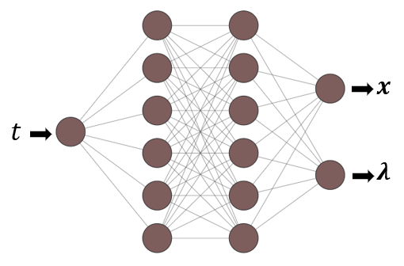
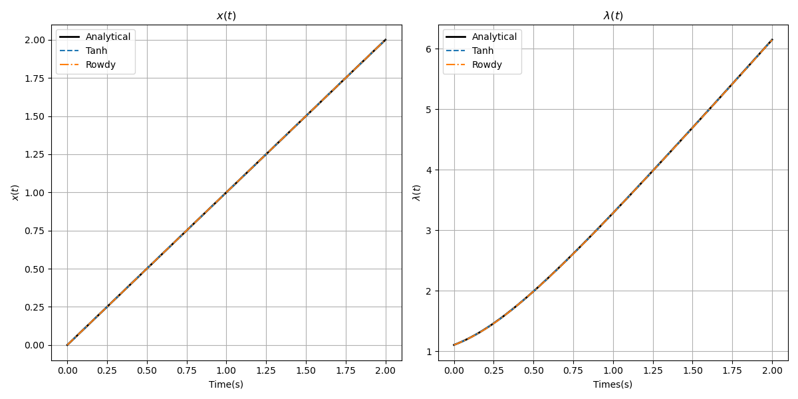
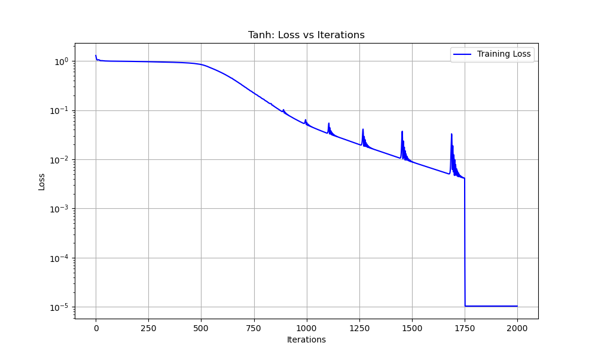
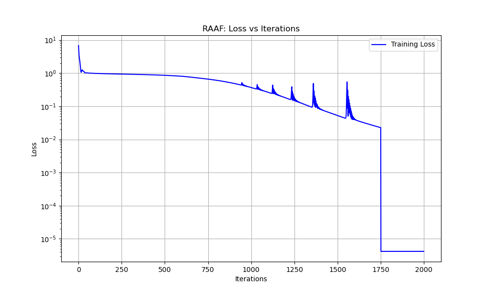
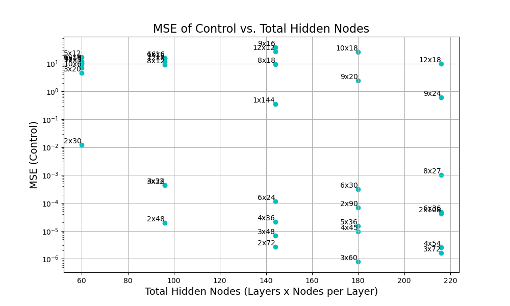
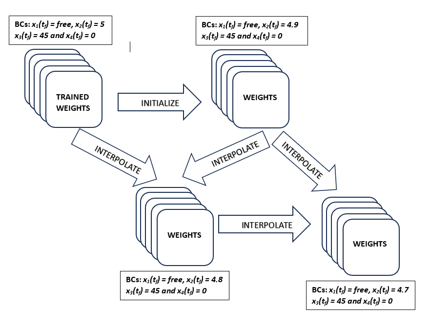
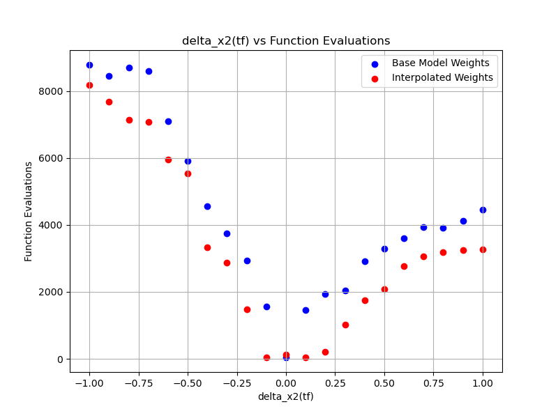
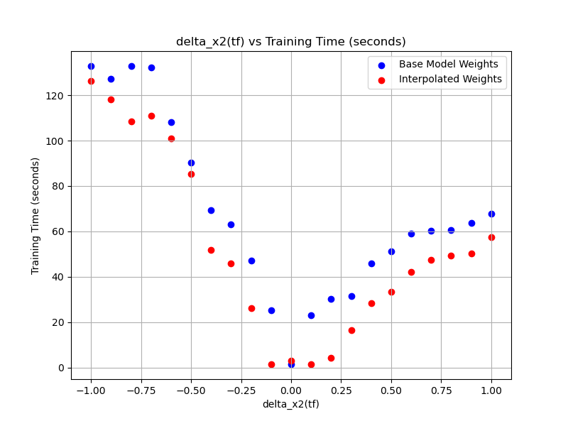

# Trajectory Optimization using Deep Neural Network

## Physics-Informed Neural Networks Architecture

Physics-Informed Neural Networks (PINNs) are a class of deep learning models designed to solve ordinary and partial differential equations (ODEs and PDEs) by incorporating physical laws directly into the neural network training process. Unlike traditional numerical methods that rely on mesh-based discretization, PINNs embed the governing equations as soft constraints into the loss function, enabling mesh-free, data-efficient, and interpretable solutions [@raissi2019physics; @karniadakis2021physics].

The key idea behind PINNs is to construct a neural network that approximates the solution to a differential equation while minimizing a composite loss function. This loss typically includes two components: (i) the residuals of the governing equations, which enforce the physical constraints, and (ii) the error at initial and boundary conditions. By training the network to reduce these terms simultaneously, PINNs produce solutions that respect both data and physics.

PINNs offer significant advantages in solving complex and high-dimensional problems in fields such as fluid dynamics, heat conduction, elasticity, and optimal control [@cuomo2022scientific]. Their ability to encode prior knowledge in the form of differential operators improves generalization and stability, especially when observational data are sparse or noisy. Recent advances have extended PINNs to handle stiff systems, multi-physics problems, and inverse modeling tasks, showcasing their versatility and growing importance in scientific computing [@wang2021understanding; @mao2020physics]. Furthermore, innovations in adaptive activation functions, domain decomposition, and transfer learning continue to enhance their accuracy and scalability [@mcclenny2020self; @shukla2021parallel].

### PINN Formulation

Consider a general first-order system of ordinary differential equations given by:

$$
\dot{\mathbf{x}}(t) = \mathbf{f}(\mathbf{x}(t), t), \quad t \in [0, t_f],
$$ {#eq-ch3-pinn-ode}

where $\mathbf{x}(t) \in \mathbb{R}^n$ is the state vector, and $\mathbf{f} : \mathbb{R}^n \times \mathbb{R} \rightarrow \mathbb{R}^n$ is a known (possibly nonlinear) function describing the system dynamics. The system is subject to an initial condition:

$$
\mathbf{x}(0) = \mathbf{x}_0.
$$ {#eq-ch3-pinn-ic}

In the PINN framework, the solution $\mathbf{x}(t)$ is approximated by a neural network $\mathbf{x}_{\theta}(t)$, where $\theta$ represents the trainable parameters of the network.

### Loss Function of PINNs

The total loss function used to train the PINN is composed of two terms: the residual loss and the initial condition loss. It is defined as:

$$
\mathcal{L}_{\text{PINN}} = \omega_1 \mathcal{L}_{\text{residual}} + \omega_2 \mathcal{L}_{\text{IC}},
$$ {#eq-ch3-pinn-loss}

where $\omega_1$ and $\omega_2$ are weighting coefficients that balance the enforcement of the system dynamics and the initial condition, where $\sum_{i=0}^{N}\omega_i = 1$

The residual loss is computed over a set of $N$ collocation points $\{t_i\}_{i=1}^{N} \subset [0, t_f]$:

$$
\mathcal{L}_{\text{residual}} = \frac{1}{N} \sum_{i=1}^{N} \left\| \frac{d}{dt} \mathbf{x}_{\theta}(t_i) - \mathbf{f}(\mathbf{x}_{\theta}(t_i), t_i) \right\|^2.
$$ {#eq-ch3-residual-loss}

The initial condition loss ensures that the predicted trajectory starts at the correct initial value:

$$
\mathcal{L}_{\text{IC}} = \left\| \mathbf{x}_{\theta}(0) - \mathbf{x}_0 \right\|^2.
$$ {#eq-ch3-ic-loss}

This formulation ensures that the learned function $\mathbf{x}_{\theta}(t)$ adheres to both the physics (via the ODE residual) and the given initial condition.

### Network Architecture

A typical PINN architecture consists of:

- **Input Layer:** Receives input variables such as time, spatial coordinates, or parameters.
- **Hidden Layers:** Multiple fully connected layers using nonlinear activation functions such as Tanh or ReLU to learn the functional mapping.
- **Output Layer:** Produces the predicted solution $\mathbf{x}_{\theta}(t) \in \mathbb{R}^n$.

This architecture is flexible and can be adapted to accommodate multiple outputs, complex nonlinearities, or additional inputs such as control parameters or auxiliary variables.

### Training Procedure

Training a PINN involves minimizing the loss function $\mathcal{L}_{\text{PINN}}$ using gradient-based optimization methods such as stochastic gradient descent (SGD) or Adam. The time derivatives of the neural network outputs are computed via automatic differentiation. During each iteration, gradients of the loss with respect to the network parameters $\theta$ are computed and used to update the model. The goal is to simultaneously minimize the equation residuals and enforce the boundary/initial conditions.

![PINNs architecture [@cuomo2022scientific]](Chapter3_imgs/pinn_model.PNG){#fig-ch3-pinn-architecture width="75%"}

### Solving Coupled ODEs

Coupled ODE systems frequently appear in scientific and engineering contexts such as trajectory optimization, chemical kinetics and multi-body dynamics. These systems consist of multiple interdependent differential equations that must be solved simultaneously.

PINNs handle coupled systems by using a NN with multiple outputs corresponding to each component of the state vector. The residuals of all coupled equations are computed and minimized together, while initial or boundary conditions for each state variable are incorporated into the loss function. This approach enables the network to learn solutions that satisfy the entire coupled system consistently.

### Advantages and Challenges

PINNs offer several advantages. By embedding prior physical knowledge, PINNs significantly reduce the need for large labeled datasets, thereby improving data efficiency [@raissi2019physics; @karniadakis2021physics]. Moreover, the solutions produced are physically consistent, which enhances generalization, even in regions beyond the training data [@cuomo2022scientific]. Another key benefit is their mesh-free nature, eliminating the need for mesh generation or discretization, which simplifies implementation for complex geometries [@raissi2019physics].

Despite these benefits, several challenges remain. Training PINNs for stiff or highly nonlinear systems often suffers from gradient imbalance and instability, which can impede convergence [@wang2021understanding; @lu2021deepxde]. Additionally, selecting appropriate weighting factors for different loss components, such as residual and boundary condition losses, is nontrivial and can significantly affect performance [@mcclenny2020self]. The computational cost is another consideration, as training deep neural networks with automatic differentiation can be resource-intensive and time-consuming [@shukla2021parallel].

Recent advances have addressed some of these challenges through methods such as adaptive activation functions, residual-based adaptive sampling, transfer learning, and domain decomposition, which improve training stability and efficiency [@mcclenny2020self; @shukla2021parallel; @lu2021deepxde].

## ODEs Solution using PINNs

### Scalar Trajectory Optimization

We consider an optimal control problem given in [@pinch1995optimal] example 4.3, involving a linear first-order dynamical system, where the state $x(t)$ evolves according to the control input $u(t)$ through the relation $\dot{x}(t) = -x(t) + u(t)$. The goal is to drive the system from the initial condition $x(0) = 0$ to the final state $x(1) = 2$ over the fixed time interval $t \in [0, 1]$. To achieve this, we aim to determine the optimal control $u(t)$ that minimizes the quadratic cost functional, which penalizes both the magnitude of the state and the control effort over time. This cost functional captures the trade-off between maintaining the state close to the origin and minimizing the energy or effort required for control.

The system dynamics, boundary conditions, and cost functional are given as:

$$
\begin{aligned}
\dot{x}(t) &= -x(t) + u(t), && \text{(System dynamics)} \\
x(0) &= 0, \quad x(1) = 2, && \text{(Boundary conditions)} \\
J &= \frac{1}{2} \int_0^1 \left( 3x^2(t) + u^2(t) \right) \, dt. && \text{(Cost functional)}
\end{aligned}
$$ {#eq-ch3-scalar-problem}

The Hamiltonian

$$
H = \frac{3}{2} x^2 + \frac{1}{2} u^2 + \lambda (-x + u).
$$ {#eq-ch3-scalar-hamiltonian}

There is no constraint on $u$, so to maximize $H$ we consider $\frac{\partial H}{\partial u}$.

$$
\frac{\partial H}{\partial u} = -u + \lambda \quad \text{and} \quad \frac{\partial^2 H}{\partial u^2} = -1.
$$ {#eq-ch3-scalar-hu}

So $H$ is maximized when $u = \lambda$ and the corresponding state equation is

$$
\dot{x} = -x + \lambda
$$ {#eq-ch3-scalar-state-ode}

and $\lambda$ satisfies

$$
\dot{\lambda} = -\frac{\partial H}{\partial x} = 3x + \lambda.
$$ {#eq-ch3-scalar-costate-ode}

Thus, $\ddot{x} = 4x$ and $\lambda = \dot{x} + x$, giving

$$
x = A \sinh(2t + \alpha)
$$ {#eq-ch3-scalar-x-sol}

and

$$
\lambda = u^* = A\left(2 \cosh(2t + \alpha) + \sinh(2t + \alpha)\right).
$$ {#eq-ch3-scalar-lambda}

The end conditions on $x$ give $\alpha = 0$ and $A = 2/\sinh 2$. Thus, the optimal control is

$$
u^* = \frac{2(2 \cosh 2t + \sinh 2t)}{\sinh 2}.
$$ {#eq-ch3-scalar-u-optimal}

$$
\begin{aligned}
\dot{x}(t) = -x(t) + \lambda(t), && \text{(State ODE)}\\
\dot{\lambda}(t) = 3x(t) + \lambda(t), && \text{(Costate ODE)}\\
\end{aligned}
$$ {#eq-ch3-scalar-state-costate}

#### Loss Function

In the PINNs framework, the state and costate equations are enforced through a loss that penalizes both the ODE residuals and the boundary conditions.

**Residual Loss.**

$$
\mathcal{L}_{\text{residual}} = \frac{1}{N} \sum_{i=1}^{N} 
\Big[ \big( \dot{x}_i + x_i - \lambda_i \big)^2 
+ \big( \dot{\lambda}_i - 3x_i - \lambda_i \big)^2 \Big],
$$ {#eq-ch3-scalar-residual}

**Boundary Condition Loss.**

$$
\mathcal{L}_{\text{BC}} = \tfrac{1}{2}(x(0)-0)^2 + (x(1)-2)^2,
$$ {#eq-ch3-scalar-bc}

**Total Loss.**

$$
\mathcal{L}_{\text{PINN}} = w_1 \mathcal{L}_{\text{residual}} + w_2 \mathcal{L}_{\text{BC}}, 
\qquad \sum_{i=1}^{m} w_i = 1.
$$ {#eq-ch3-scalar-total-loss}

### Linear Tangent Steering Problem

As explained in Section 2.3, the Linear Tangent Steering (LTS) problem is a time-optimal control problem that aims to minimize the transfer time of the vehicle while satisfying the system dynamics and boundary conditions.

#### Hyperparameters

The PINNs model employs a fully connected feedforward neural network with 2 hidden layers, each containing 8 neurons. Training is conducted using the Adam optimizer with an initial learning rate of $10^{-3}$ over initial 1750 iterations and for next iterations 250 L-BFGS is employed. The total loss function uses weights $w_1 = 0.1$ and $w_2 = 0.9$ to prioritize boundary conditions. The model is trained with 100 domain collocation points and 2 boundary points at $t = 0$ and $t$. The architecture of the PINN designed for this problem is shown in @fig-ch3-pinn-scalar.

{#fig-ch3-pinn-scalar width="55%"}

### Tanh Activation Function

The accuracy depends on the number of trainable parameters, so the number of the trainable parameters in the given architecture for Tanh activation function is given by the below calculation:

For each layer in the network:

$$
\begin{aligned}
\text{Number of Weights} &= n_\text{current} \times n_\text{next}, \\
\text{Number of Biases} &= n_\text{next}, \\
\text{Number of Parameters} &= \text{Number of Weights} + \text{Number of Biases}.
\end{aligned}
$$ {#eq-ch3-param-count}

where $n_\text{current} =$ number of nodes in current layer and $n_\text{next} =$ number of nodes in next layer.

The total number of trainable parameters is the sum of the parameters across all layers.

| Layer | No of Weights | No of Biases | Total Parameters |
|:------|:-------------:|:------------:|:----------------:|
| Input to $1^{st}$ Hidden Layer | $1 \times 16 = 16$ | $16$ | $16 + 16 = 32$ |
| $1^{st}$ Hidden to $2^{nd}$ Hidden Layer | $16 \times 16 = 256$ | $16$ | $256 + 16 = 272$ |
| $2^{nd}$ Hidden to Output Layer | $16 \times 2 = 32$ | $2$ | $32 + 2 = 34$ |
| **Total** | $16 + 256 + 32 = 304$ | $16 + 16 + 2 = 34$ | $32 + 272 + 34 = 338$ |

: Trainable Parameters per Layer (Tanh) {#tbl-ch3-trainable-tanh}

Thus, the total number of trainable parameters in the network is $338$.

Using the same network configuration with a Tanh activation function, the training process yielded a total loss of $\mathcal{L} = 1.038 \times 10^{-4}$. When compared against the analytical solution, the Root Mean Square (RMS) errors for the state and costate variables are $2.44 \times 10^{-3}$ and $3.64 \times 10^{-3}$. These results confirm the efficacy of the chosen network architecture and highlight the capability of the Tanh activation function in approximating the solution with a certain level of accuracy.

### Rowdy Adaptive Activation Function (RAAF)

The development of sophisticated neural network architectures has been pivotal in advancing complex machine learning applications. One such innovation is the RAAF [@ccelik2024optimal], designed to enhance the learning capability and generalization power of neural networks by integrating adaptive and oscillatory properties into traditional activation functions. This function introduces a novel approach to balancing expressiveness and training stability, utilizing modifications of standard activations such as the Tanh function.

#### Modified Tanh Function

At the core of RAAF lies a modified Tanh function, mathematically expressed as:

$$
\sigma(x; \alpha) = \frac{e^{\alpha x} - e^{-\alpha x}}{e^{\alpha x} + e^{-\alpha x}},
$$ {#eq-ch3-modified-tanh}

where $\alpha$ is a trainable parameter that scales the input, providing flexibility in the activation behavior. By allowing $\alpha$ to adapt during training, the network gains additional capacity to capture complex patterns in data. This adaptive feature accelerates convergence, particularly in the early training stages, by reshaping the gradient landscape to avoid saturation.

#### Rowdy Adaptive Activation Function

RAAF [@jagtap2022deep] extends this concept by combining the modified Tanh function with trigonometric terms, introducing oscillatory components that enrich the activation function's representational diversity:

$$
\sigma_{\text{rowdy}}(x) = \sigma_{\text{base}}(x; \alpha) + \sum_{k=1}^N \beta_k \sin(k \omega x),
$$ {#eq-ch3-raaf}

where:
$\sigma_{\text{base}}(x; \alpha)$ represents the adaptive Tanh function.
$\beta_k$ and $\omega$ are trainable parameters that control the amplitude and frequency of the oscillations.

This design ensures smoother loss landscapes during training, reducing the risk of convergence to local minima. The oscillatory components are particularly useful in handling high-frequency variations in the data, enabling the model to generalize effectively across diverse input distributions.

For each layer in the network:

$$
\begin{aligned}
\text{Number of Weights} &= n_\text{current} \times n_\text{next}, \\
\text{Number of Biases} &= n_\text{next}, \\
\text{Number of Parameters} &= \text{Weights} + \text{Biases}.
\end{aligned}
$$ {#eq-ch3-raaf-param-count}

where $n_\text{current} =$ number of nodes in current layer and $n_\text{next} =$ number of nodes in next layer.

Additionally, the RAAF adds:

$$
\text{Parameters}_\text{rowdy} = n_\text{hidden} \times \text{RAAF parameters}
$$ {#eq-ch3-raaf-extra}

for each neuron in the hidden layers.

The total number of trainable parameters is the sum of all weights, biases, and RAAF-specific parameters.

| Layers | No of Weights | No of Biases | RAAF Parameters | Total Parameters |
|:-------|:-------------:|:------------:|:---------------:|:----------------:|
| I/P to Hidden Layer | $1 \times 20 = 20$ | $20$ | $20 \times 3 = 60$ | $20 + 20 + 60 = 100$ |
| Hidden to O/P Layer | $20 \times 2 = 40$ | $2$ | $0$ | $40 + 2 + 0 = 42$ |
| **Total** | $60$ | $22$ | $60$ | $142$ |

: Trainable Parameters per Layer (RAAF) {#tbl-ch3-trainable-raaf}

Thus, the total number of trainable parameters in the network is: 142

Using the RAAF with one hidden layer and 20 nodes in the hidden layer, the training process achieved a total loss of $\mathcal{L} = 4.19 \times 10^{-5}$. When compared to the analytical solution, the RMS errors for the state and costate variables were $6.54 \times 10^{-5}$ and $5.84 \times 10^{-5}$. These results demonstrate the effectiveness of the RAAF in improving the accuracy of the solution while maintaining robust convergence properties with less number of trainable parameters.

{#fig-ch3-raaf-solution width="75%"}

::: {#fig-ch3-error-comparison layout-ncol=2}
{#fig-ch3-tanh-error}

{#fig-ch3-raaf-error}

Comparison of the Total errors.
:::

## Linear Tangent Steering Problem

### PINNs Method

#### Objective Function and Hamiltonian Derivation

The objective of the LTS problem is to minimize the final time $t_f$. Thus, the performance index (objective function) is:

$$
J = \int_{0}^{t_f} 1 \, dt = t_f.
$$ {#eq-ch3-lts-objective}

According to Pontryagin's Maximum Principle, we define the Hamiltonian $\mathcal{H}$ as:

$$
\mathcal{H} = 1 + \lambda_1 \dot{x}_1 + \lambda_2 \dot{x}_2 + \lambda_3 \dot{x}_3 + \lambda_4 \dot{x}_4.
$$ {#eq-ch3-lts-hamiltonian}

Substituting the expressions for the state derivatives:

$$
\begin{aligned}
\mathcal{H} &= 1 + \lambda_1 x_3 + \lambda_2 x_4 + \lambda_3 a \cos(u) + \lambda_4 a \sin(u).
\end{aligned}
$$ {#eq-ch3-lts-hamiltonian-sub}

#### Costate Equations

The costate dynamics are obtained from:

$$
\dot{\lambda}_i = -\frac{\partial \mathcal{H}}{\partial x_i}, \quad i = 1,2,3,4.
$$ {#eq-ch3-lts-costate-general}

Calculating the partial derivatives:

$$
\begin{aligned}
\dot{\lambda}_1 &= -\frac{\partial \mathcal{H}}{\partial x_1} = 0, \\
\dot{\lambda}_2 &= -\frac{\partial \mathcal{H}}{\partial x_2} = 0, \\
\dot{\lambda}_3 &= -\frac{\partial \mathcal{H}}{\partial x_3} = -\lambda_1, \\
\dot{\lambda}_4 &= -\frac{\partial \mathcal{H}}{\partial x_4} = -\lambda_2.
\end{aligned}
$$ {#eq-ch3-lts-costate}

#### Optimal Control Law

The optimal control $u^*(t)$ minimizes the Hamiltonian with respect to the control input $u(t)$:

$$
u^*(t) = \arg\min_u \mathcal{H} = \arg\min_u \left( \lambda_3 a \cos(u) + \lambda_4 a \sin(u) \right).
$$ {#eq-ch3-lts-optimal-control}

This expression can be rewritten as:

$$
\mathcal{H}_{u} = a \left( \lambda_3 \cos(u) + \lambda_4 \sin(u) \right).
$$ {#eq-ch3-lts-hu}

To minimize $\mathcal{H}_u$, the optimal control is given by:

$$
u^*(t) = \tan^{-1}\left( \frac{\lambda_4(t)}{\lambda_3(t)} \right),
$$ {#eq-ch3-lts-u-optimal}

#### Boundary Conditions

The boundary conditions for the LTS problem are:

- **Initial (fixed) conditions:**

$$
x_1(0) = 0, \quad x_2(0) = 0, \quad x_3(0) = 0, \quad x_4(0) = 0
$$ {#eq-ch3-lts-ic}

- **Final (partially fixed) conditions:**

$$
x_2(t_f) = 5, \quad x_3(t_f) = 45, \quad x_4(t_f) = 0
$$ {#eq-ch3-lts-fc}

- **Transversality condition (due to free final state):**

$$
\lambda_1(t_f) = 0 \quad \text{(since } x_1(t_f) \text{ is free)}
$$ {#eq-ch3-lts-transversality}

#### Loss Function for Domain

In the PINNs framework, the domain loss based on the residuals of the state and costate ODEs is defined as:

$$
\mathcal{L}_{\text{residual}} = \frac{1}{N}\sum_{i=1}^{N} \left[ 
\sum_{j=1}^{4} \left( \frac{d x_j}{d t}(t_i) - f_j(\mathbf{x}(t_i), u(t_i)) \right)^2 
+ \sum_{j=1}^{4} \left( \frac{d \lambda_j}{d t}(t_i) - g_j(\boldsymbol{\lambda}(t_i)) \right)^2 
\right],
$$ {#eq-ch3-lts-domain-loss}

where $f_j$ and $g_j$ denote the right-hand sides of the state and costate ODEs.

#### Loss Function for Boundary Conditions

The boundary loss enforces the known initial and final values, including the transversality condition:

$$
\begin{aligned}
\mathcal{L}_{\text{BC}} = &\frac{1}{4} {\left( x_j(0) - x_{j,0} \right)^2 
+ \left( x_2(t_f) - 5 \right)^2 
+ \left( x_3(t_f) - 45 \right)^2 
+ \left( x_4(t_f) - 0 \right)^2 
+ \left( \lambda_1(t_f) \right)^2}
\end{aligned}
$$ {#eq-ch3-lts-bc-loss}

#### Total Loss Function

The complete loss function for training the PINN model becomes:

$$
\mathcal{L}_{\text{PINN}} = w_1 \mathcal{L}_{\text{residual}} + w_2 \mathcal{L}_{\text{BC}},
$$ {#eq-ch3-lts-total-loss}

where $w_1 + w_2 = 1$ are hyperparameters controlling the balance between enforcing dynamics and boundary constraints.

#### Hyperparameters Tuning

For hyperparameter tuning, the training process employs a total of $30{,}000$ iterations, with a total loss threshold of $10^{-4}$ used as the primary stopping criterion. To enhance stability, a patience mechanism [@sanchez2018real] is incorporated: once the loss falls below $10^{-4}$, training continues for an additional $20$ iterations to ensure the loss consistently remains under the specified threshold.

The training procedure adopts a two-stage Optimization strategy. During the first stage, $90\%$ of the total iterations are executed using the **Adam** optimizer with a learning rate of $10^{-3}$, allowing for efficient convergence in the initial phase. In the second stage, the remaining $10\%$ of iterations utilize the **L-BFGS** optimizer for fine-tuning. The L-BFGS method is configured with a maximum of $50{,}000$ iterations, a history size of $50$, and a strong Wolfe line search condition.

This hybrid approach leverages the fast convergence properties of first-order methods during early training, while exploiting the higher accuracy of second-order methods in refining the solution as the loss approaches its minimum.

To place greater emphasis on control within the physics-informed loss, we include the term

$$
\frac{\partial H}{\partial U} = 0 = -\lambda_3 \sin U + \lambda_4 \cos U
$$ {#eq-ch3-lts-control-loss}

as part of the loss formulation.

As the analytical solution is available, the error of control is considered for tuning the network parameters. The below diagram shows how the error varied for the Tanh activation function for different number of hidden layers and nodes. The model with 3 hidden layers each with 60 nodes @fig-ch3-hp-control shows the best results, therefore, this model is used for further studies.

{#fig-ch3-hp-control width="75%"}

| Variable | MSE |
|:---------|----:|
| $x_1$ | $3.01 \times 10^{-9}$ |
| $x_2$ | $4.44 \times 10^{-9}$ |
| $x_3$ | $5.52 \times 10^{-8}$ |
| $x_4$ | $6.72 \times 10^{-8}$ |
| Control $u$ | $2.34 \times 10^{-5}$ |
| Error final Time $\varepsilon_{t_f}$ | $1.89 \times 10^{-6}$ |

: Mean Squared Error (MSE) for States, Control, and Final Time {#tbl-ch3-mse-lts}

In the LTS case, careful tuning enabled the network to achieve mean squared errors (MSE) as low as $10^{-5}$ for control. This level of accuracy demonstrates the model's ability to learn the underlying physics while maintaining smooth and stable control profiles.

### Weights Initialization and Interpolation

{#fig-ch3-interpolation width="75%"}

#### Random Walk Initialization for LTS Problem

A *random walk* approach was utilized within the PINNs framework to efficiently solve variations of the LTS problem under different boundary conditions. After successfully training the network for a base case (e.g., with $x_2(t_f) = 5.0$), the trained weights were saved. These weights capture meaningful features and the underlying dynamics of the problem corresponding to the given boundary condition.

For a slightly perturbed case such as $x_2(t_f) = 4.9$, instead of retraining the network from random initialization, the saved weights were reused to initialize the network. This reuse significantly reduced the number of iterations required for convergence. The network adapted quickly to the new scenario since the dynamics remained similar, and the pre-trained weights already encoded a near-optimal structure of the solution. This process can be interpreted as performing a "random walk" in the parameter space progressively stepping from known solutions to nearby perturbed cases.

Furthermore, for a range of other perturbations in $x_2(t_f)$, a linear interpolation of weights from nearby trained cases was used to generate initial guesses. These interpolated weights provided good initialization even in untrained regions of the parameter space, again accelerating convergence and improving training stability.

In essence, this method acts as a time-saving mechanism, instead of solving each variation from scratch, which is computationally intensive, the PINNs leverage prior knowledge through a random walk strategy. This greatly enhances training efficiency and enables real-time adaptability in solving trajectory Optimization problems such as LTS, which is evident in the below figure.

::: {#fig-ch3-interpolation-results layout-ncol=2}
{#fig-ch3-fe-eval}

{#fig-ch3-train-time}

:::

#### Recursive Weight Interpolation Procedure

The interpolation approach is based on perturbing the final state condition $x_2(t_f)$ and utilizing the learned weights to extrapolate weights for further perturbations.

- The first perturbation is applied with $\Delta x_2(t_f) = -0.1$, i.e., $x_2(t_f) = 4.9$. The network is trained using this modified final state by incorporating it into the loss function.

- This network is initialized using the base weights (corresponding to $x_2(t_f) = 5.0$) and trained with the same stopping criterion as the base model. The loss drops below $10^{-4}$ within 300 iterations, indicating that the base weights significantly aided faster convergence. The network successfully adapted to the new final state with a much smaller error compared to training from scratch.

- Once the network is trained for the perturbed final state $x_2(t_f) = 4.9$, the interpolation process is extended recursively to generate weights for additional perturbations.

The core idea is to use a linear interpolation formula to predict new weights:

$$
w_{\text{new}} = m \cdot x_{2\text{(tf,new)}} + b
$$ {#eq-ch3-interpolation}

where:

$$
m = \frac{w_2 - w_1}{x_{2\text{(tf,2)}} - x_{2\text{(tf,1)}}}, \quad b = w_1 - m \cdot x_{2\text{(tf,1)}}
$$ {#eq-ch3-interpolation-slope}

- The weights corresponding to $x_2(t_f) = 5.0$ and $x_2(t_f) = 4.9$ are used to extrapolate the weights for $x_2(t_f) = 4.8$.

- After verifying the performance of the network at $x_2(t_f) = 4.8$, the weights for $x_2(t_f) = 4.9$ and $4.8$ are used to extrapolate for $x_2(t_f) = 4.7$, and so on.

- This recursive interpolation continues by always using the most recent two trained or extrapolated weight sets, i.e.,

$$
\text{Use } (w_{x_2 = 4.8}, w_{x_2 = 4.7}) \rightarrow w_{x_2 = 4.6}, \quad \text{and so on,}
$$ {#eq-ch3-recursive}

until the final state condition $x_2(t_f) = 4.0$ is reached.

- A similar process is carried out in the forward direction. After training the network at $x_2(t_f) = 5.1$, the weights corresponding to $x_2(t_f) = 5.0$ and $5.1$ are used to extrapolate for $x_2(t_f) = 5.2$.

- This forward recursive interpolation is repeated until $x_2(t_f) = 6.0$ is reached.

- At each step, the accuracy of interpolated weights is evaluated by comparing them with weights obtained through direct training for the corresponding final state condition.

### Effect of Activation Function on Model Performance

To investigate the role of activation functions in learning-based control tasks, we evaluate three variants: the standard Tanh, Layer-wise Locally Adaptive Activation Functions (L-LAAF) [@jagtap2022deep], and RAAF, implemented using the Rowdy formulation. These functions are tested in identical training setups to ensure fairness in comparison.

Each model is trained under the same initialization, training data, and stopping criteria. The goal is to assess how these activation functions impact convergence, stability, and the network's ability to generalize across perturbed final state conditions.

**1. Accuracy Comparison (Mean Squared Error)**

The Mean Squared Error (MSE) for key variables—state components $x_1, x_2, x_3, x_4$, control input $u$, and final time $t_f$—is computed post-training. The results are summarized in the table below:

| Variable | RAAF | L-LAAF | Tanh |
|:---------|-----:|-------:|-----:|
| $x_1$ | $2.10 \times 10^{-9}$ | $1.74 \times 10^{-8}$ | $3.01 \times 10^{-9}$ |
| $x_2$ | $3.98 \times 10^{-9}$ | $3.56 \times 10^{-9}$ | $4.44 \times 10^{-9}$ |
| $x_3$ | $7.03 \times 10^{-9}$ | $9.57 \times 10^{-8}$ | $5.52 \times 10^{-8}$ |
| $x_4$ | $7.61 \times 10^{-9}$ | $6.07 \times 10^{-8}$ | $6.72 \times 10^{-8}$ |
| Control $u$ | $2.01 \times 10^{-6}$ | $1.69 \times 10^{-5}$ | $2.34 \times 10^{-5}$ |
| Final Time $t_f$ | $8.56 \times 10^{-7}$ | $8.06 \times 10^{-7}$ | $1.89 \times 10^{-6}$ |

: Comparison of MSE for different activation functions {#tbl-ch3-mse-activation}

RAAF yields the lowest MSE across most variables, especially in control and states $x_1$ and $x_2$, indicating strong learning and generalization. L-LAAF performs well, particularly in final time $t_f$, but exhibits higher errors in control and velocity states ($x_3$, $x_4$). In contrast, **Tanh** shows the highest error in control and final time, suggesting less adaptability to dynamic conditions.

We also compare the number of function evaluations and the total training time required for each activation:

| Metric | Tanh | L-LAAF | RAAF |
|:-------|-----:|-------:|-----:|
| Function Evaluations | 56625 | 56354 | 57871 |
| Training Time (s) | 782.23 | 1062.65 | 4637.72 |

: Comparison of Function Evaluations and Training Time {#tbl-ch3-fe-time}

Tanh and L-LAAF are computationally cheaper, requiring fewer function evaluations and less training time. In contrast, RAAF takes significantly longer to train, likely due to the complexity of its adaptive mechanism. Despite the higher computational cost, RAAF delivers superior accuracy, indicating a trade-off between computational expense and learning performance. The choice of activation function thus plays a crucial role in determining both learning accuracy and computational efficiency. While RAAF achieves the best accuracy, it comes with greater complexity, whereas L-LAAF offers a balanced trade-off and Tanh serves as a baseline with minimal computational demand.

### Simplified LTS Model with Trainable Parameters

In the original trajectory optimization framework using LTS, the control input $u$ is computed indirectly from the costate variables, derived from Pontryagin's Maximum Principle. Specifically, the optimal control law is given by:

$$
u(t) = \tan^{-1}\left(\frac{\lambda_4(t)}{\lambda_3(t)}\right)
$$ {#eq-ch3-original-control}

This requires the neural network to output not only the state variables $x(t), y(t), u(t), v(t)$, but also the costate variables $\lambda_1(t), \lambda_2(t), \lambda_3(t), \lambda_4(t)$, resulting in a total of 8 outputs.

**Proposed Approach:**

We propose a simplified and more efficient formulation that avoids predicting costate variables altogether. Leveraging the analytical structure of the LTS problem, the optimal control $u(t)$ is known to follow the form:

$$
u(t) = \tan^{-1} \left( \frac{c_1}{c_2} + \frac{c_3}{c_2} t \right)
$$ {#eq-ch3-simplified-control}

Here, $c_1, c_2, c_3$ are problem-dependent constants. In the proposed method, we treat these constants as *trainable parameters* within the neural network. The network now only needs to output the 4 state variables.

The control input $u(t)$ is computed using the parameterized control law in Equation, bypassing the need to estimate costates.

**Advantages of This Simplification:**

- **Reduced Network Complexity:** By eliminating the need to predict costates, the network output size is halved—from 8 outputs to 4.
- **Improved Training Efficiency:** With fewer outputs and a structured control law, the learning problem becomes easier to optimize.
- **Faster Convergence:** The model converges faster due to fewer trainable outputs and the use of domain-specific knowledge embedded in the control law.
- **Interpretability:** The learned parameters $c_1, c_2, c_3$ provide insights into the structure of the optimal control, enhancing model transparency.

The constants $c_1, c_2, c_3$ are learned alongside the network weights during training. During forward passes, $u(t)$ is computed directly from the equation using the current value of time $t$ and the learned parameters.

This approach tightly couples the control structure with the known analytical solution form, reducing the burden on the network and improving generalization. It exemplifies how hybridizing physics-based insight with learning-based models can yield both performance and interpretability benefits.

| Metric | RAAF | Simplified LTS: RAAF |
|:-------|-----:|---------------------:|
| State 1 Error | $2.1008 \times 10^{-9}$ | $4.3835 \times 10^{-9}$ |
| State 2 Error | $3.9782 \times 10^{-9}$ | $4.5787 \times 10^{-9}$ |
| State 3 Error | $7.0327 \times 10^{-9}$ | $5.0759 \times 10^{-9}$ |
| State 4 Error | $7.6105 \times 10^{-9}$ | $7.8337 \times 10^{-9}$ |
| Control Error | $2.0105 \times 10^{-6}$ | $3.2782 \times 10^{-8}$ |
| Error in $t_f$ | $8.5635 \times 10^{-7}$ | $1.5023 \times 10^{-7}$ |

: Error comparison between original RAAF and Simplified LTS: RAAF model. {#tbl-ch3-simplified}

The simplified LTS model maintains low state errors while significantly reducing the control error. Notably, the training time of the simplified model is $2276.0\,\text{s}$, which is approximately half that of the original RAAF model. Additionally, the number of function evaluations is reduced to $57477$, highlighting the efficiency of the proposed approach. This trade-off between model simplicity and performance effectively reduces network complexity and improves computational efficiency without compromising accuracy.

### Limitations with the PINNs Method for OCP

As the number of states increases in an optimal control problem—for instance, from four to five by including an additional state such as the pitch angle and its corresponding ODE—the total loss during PINN training has been observed to diverge. This divergence is largely due to the added complexity introduced by the additional differential constraints, which significantly increases the number of residual terms the network must learn to satisfy. Each new state variable contributes both a state ODE and its associated costate equation in the Hamiltonian formalism, effectively doubling the number of ODE constraints. Consequently, the loss function becomes composed of many competing objectives, such as the state dynamics, costate dynamics, and boundary/initial conditions, which can conflict during Optimization.

This issue has been identified in the literature as a major limitation in PINN-based methods for optimal control. Mowlavi and Nabi [@mowlavi2022] highlighted that in PDE-constrained optimal control problems, the presence of multiple differential constraints—especially when each comes with a state and costate component—can destabilize training due to the imbalance in the loss function. Similarly, Barry-Straume et al. [@barry2022controlpinns] observed that as more equations are embedded into the PINN loss (e.g., due to additional state variables), the learning dynamics degrade, resulting in either stagnation or divergence of the total loss. Moreover, New et al. [@new2022] showed empirically that increasing the number of coupled ODEs, even in relatively simple settings, leads to poor convergence behavior due to the ill-conditioning of the Optimization landscape and vanishing or exploding gradients.