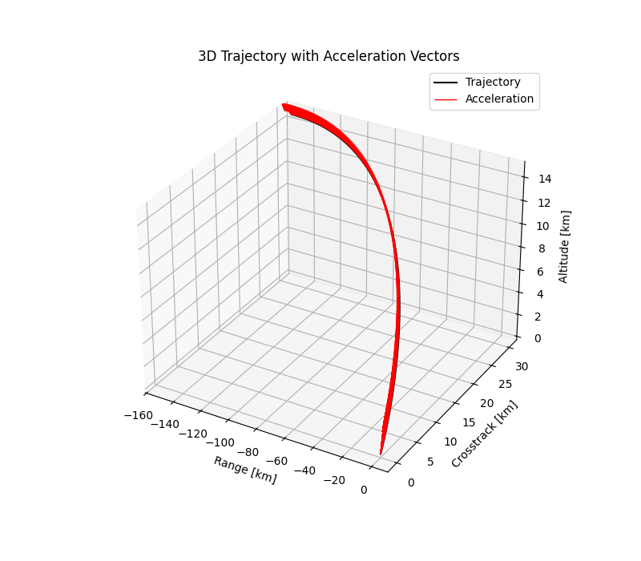

# Theory of Functional Connections (TFC) for Solving Optimal Control Problems

To overcome the limitations of Physics-Informed Neural Networks (PINNs) in solving optimal control problems (OCPs), this chapter introduces the Theory of Functional Connections [@mortari2017least] (TFC), a mathematically rigorous framework derived from the Theory of Connections (ToC). While PINNs have been proposed as a mesh-free alternative for solving the Two-Point Boundary Value Problems (TPBVPs) arising from indirect formulations of OCPs, they often struggle with convergence when the number of states and costates increases. The resulting complexity in the loss function, composed of multiple ODE residuals, boundary conditions, and transversality constraints, leads to gradient imbalance and divergence during training, limiting the reliability of PINNs in high-dimensional or tightly coupled systems.

TFC addresses these issues by embedding boundary and initial conditions directly into the functional form of the solution using constrained expressions. This eliminates the need for explicitly penalizing constraint violations in the loss function, as is done in PINNs, and transforms the problem into an unconstrained least-squares Optimization over the free function components. As a result, TFC avoids the instability and sensitivity associated with neural network-based solvers while maintaining high accuracy and computational efficiency.

This chapter explores the application of TFC to optimal control problems [@furfaro2020least], with case studies including energy-optimal planetary landing and space interception problems. Through detailed simulations and comparisons, it is demonstrated that TFC provides a robust and scalable alternative to both traditional numerical solvers and PINN-based approaches, particularly in scenarios where neural-network solutions tend to diverge.

## Solution to TPBVPs Using the TFC

This section describes the methodology for solving nonlinear Two-Point Boundary Value Problems (TPBVPs) using the Theory of Functional Connections (TFC). The approach transforms the original boundary-constrained differential problem into an unconstrained problem by embedding the boundary conditions analytically into the solution structure.

### General Formulation of the TVBVP

We consider the linear boundary value problem [@furfaro2020least]:

$$
\dot{x}(t) + 2t\,x(t) = \sin(t), \quad t \in [0, 1], \quad x(0) = 0,\quad x(1) = 1.
$$

To embed the boundary conditions, we define a constrained expression using the Theory of Functional Connections:

$$
x(t) = g(t) + (1 - t)x(0) + t x(1) - (1 - t) g(0) - t g(1).
$$

Substituting the known boundary values $x(0) = 0$, $x(1) = 1$, this simplifies to:

$$
x(t) = g(t) + t - (1 - t)g(0) - t g(1).
$$

Differentiating this expression gives:

$$
\dot{x}(t) = \dot{g}(t) + 1 - g(1) + g(0).
$$

Substituting $x(t)$ and $\dot{x}(t)$ into the original differential equation:

$$
\dot{g}(t) + 1 - g(1) + g(0) + 2t\left( g(t) + t - (1 - t)g(0) - t g(1) \right) = \sin(t).
$$

Expanding the right-hand side:

$$
\dot{g}(t) + 2t g(t) + g(0)(1 - 2t + 2t^2) + g(1)(-1 - 2t^2) + (1 + 2t^2) = \sin(t).
$$

Rewriting, we define the residual function:

$$
R(t) = \dot{g}(t) + 2t g(t) + \gamma_0(t) g(0) + \gamma_1(t) g(1) + r(t) - \sin(t),
$$

where:

$$
\gamma_0(t) = 1 - 2t + 2t^2, \quad \gamma_1(t) = -1 - 2t^2, \quad r(t) = 1 + 2t^2.
$$

We now express the free function $g(t)$ as a linear combination of basis functions:

$$
g(t) = \sum_{i=1}^{m} c_i \phi_i(t), \quad \dot{g}(t) = \sum_{i=1}^{m} c_i \dot{\phi}_i(t).
$$

At a set of collocation points $\{ t_j \}_{j=1}^N \in [0,1]$, we evaluate the residual:

$$
R(t_j) = \sum_{i=1}^{m} c_i \left[ \dot{\phi}_i(t_j) + 2t_j \phi_i(t_j) - \gamma_0(t_j)\phi_i(0) - \gamma_1(t_j)\phi_i(1) \right] + r(t_j) - \sin(t_j).
$$

This defines a linear least-squares system $A\mathbf{c} = \mathbf{b}$, where:

$$
A_{ji} = \dot{\phi}_i(t_j) + 2t_j \phi_i(t_j) - \gamma_0(t_j)\phi_i(0) - \gamma_1(t_j)\phi_i(1),
\quad
b_j = \sin(t_j) - r(t_j).
$$

Solving this system yields the coefficients $\{ c_i \}$, from which we reconstruct:

$$
g(t) = \sum_{i=1}^{m} c_i \phi_i(t),
\quad
g(0) = \sum_{i=1}^{m} c_i \phi_i(0),
\quad
g(1) = \sum_{i=1}^{m} c_i \phi_i(1).
$$

The final solution is then:

$$
x(t) = g(t) + t - (1 - t)g(0) - t g(1).
$$

This function $x(t)$ satisfies the original boundary conditions exactly and approximates the solution to the differential equation by minimizing the residual in a least-squares sense.

### Energy Optimal Planetary Landing via Theory of Connections

In this section, we consider the energy-optimal landing problem of a spacecraft descending towards a planetary surface. The simplified dynamics of the spacecraft assume constant gravitational acceleration $\mathbf{g}$ and control input in the form of thrust-induced acceleration $\mathbf{a}_C(t)$. The equations of motion governing the system are given by:

$$
\dot{\mathbf{r}}(t) = \mathbf{v}(t),
$$

$$
\dot{\mathbf{v}}(t) = \mathbf{g} + \mathbf{a}_C(t),
$$

where $\mathbf{r}(t) \in \mathbb{R}^3$ is the position vector and $\mathbf{v}(t) \in \mathbb{R}^3$ is the velocity vector of the spacecraft.

The objective is to minimize the total control effort, which corresponds to minimizing the energy expenditure. This is represented by the performance index:

$$
J = \frac{1}{2} \int_{t_0}^{t_f} \|\mathbf{a}_C(t)\|^2 \, dt.
$$ {#eq-ch4-j}

The boundary conditions specify the initial and final states:

$$
\mathbf{r}(t_0) = \mathbf{r}_0, \quad \mathbf{v}(t_0) = \mathbf{v}_0,
$$

$$
\mathbf{r}(t_f) = \mathbf{r}_f = \mathbf{0}, \quad \mathbf{v}(t_f) = \mathbf{v}_f = \mathbf{0}.
$$

To solve this optimal control problem, we apply Pontryagin's Minimum Principle (PMP). The Hamiltonian is defined as:

$$
\mathcal{H} = \frac{1}{2} \|\mathbf{a}_C\|^2 + \boldsymbol{\lambda}_r^T \mathbf{v} + \boldsymbol{\lambda}_v^T (\mathbf{g} + \mathbf{a}_C),
$$ {#eq-ch4-hamiltonian}

where $\boldsymbol{\lambda}_r$ and $\boldsymbol{\lambda}_v$ are the costate vectors associated with $\mathbf{r}(t)$ and $\mathbf{v}(t)$, respectively.

From the optimality condition $\partial \mathcal{H}/\partial \mathbf{a}_C = 0$, we obtain the optimal control law:

$$
\mathbf{a}_C = -\boldsymbol{\lambda}_v.
$$ {#eq-ch4-ac}

Substituting this into the state and costate equations yields the two-point boundary value problem (TPBVP):

$$
\dot{\mathbf{r}} = \mathbf{v}, \quad \dot{\boldsymbol{\lambda}}_r = \mathbf{0},
$$

$$
\dot{\mathbf{v}} = \mathbf{g} - \boldsymbol{\lambda}_v, \quad \dot{\boldsymbol{\lambda}}_v = -\boldsymbol{\lambda}_r.
$$

An analytical solution for the acceleration profile that satisfies these conditions is given by:

$$
\mathbf{a}_C(t) = \frac{6}{t_{go}^2} (\mathbf{r}_f - \mathbf{r}_0) - \frac{4}{t_{go}} (\mathbf{v}_f - \mathbf{v}_0) - \mathbf{g},
$$

where $t_{go} = t_f - t$ is the time-to-go until touchdown.

To solve this problem using the Theory of Connections (ToC), we construct constrained expressions for $\mathbf{r}(t)$ and $\mathbf{v}(t)$ that automatically satisfy the boundary conditions. These expressions take the form:

$$
\mathbf{r}(t) = \mathbf{g}_r(t) + \mathbf{r}_0 + (t - t_0) \left( \frac{\mathbf{r}_f - \mathbf{r}_0}{t_f - t_0} - \mathbf{g}_r(t_f) \right),
$$

$$
\mathbf{v}(t) = \mathbf{g}_v(t) + \mathbf{v}_0 + (t - t_0) \left( \frac{\mathbf{v}_f - \mathbf{v}_0}{t_f - t_0} - \mathbf{g}_v(t_f) \right),
$$

where $\mathbf{g}_r(t)$ and $\mathbf{g}_v(t)$ are free functions expanded in a basis of Chebyshev polynomials:

$$
\mathbf{g}_r(t) = \sum_{k=0}^{m} c_k T_k(\tau(t)), \quad \tau(t) \in [-1, 1],
$$ {#eq-ch4-chebyshev}

with $T_k$ denoting the Chebyshev polynomials of the first kind and $c_k$ the unknown coefficients.

The residuals of the transformed equations of motion are then minimized in a least-squares sense by discretizing the time domain at $N$ collocation points and solving the resulting overdetermined linear system:

$$
\boldsymbol{\xi} = (A^T A)^{-1} A^T \mathbf{b},
$$ {#eq-ch4-lstsq}

where $A$ is the matrix formed from the basis functions and $\mathbf{b}$ is the vector of discretized residuals.

For simulation, the initial position and velocity are given by $\mathbf{r}_0 = [160, 0, 1500]^T$ m and $\mathbf{v}_0 = [100, 0, -75]^T$ m/s. The final conditions are zero position and velocity, and gravitational acceleration is assumed constant as $\mathbf{g} = [0, 0, -1.625]^T$ m/s$^2$. The total flight time is taken as $t_f = 50$ s.

{#fig-ch4-3d-trajectory width="75%"}

The ToC-based solver produces accurate estimates of the state and costate trajectories, and the resulting control input minimizes the energy cost functional. The numerical solution agrees well with results obtained via standard MATLAB solvers such as `bvp4c` and with analytical predictions, demonstrating both the effectiveness and computational efficiency of the ToC approach in solving energy-optimal planetary landing problems.
