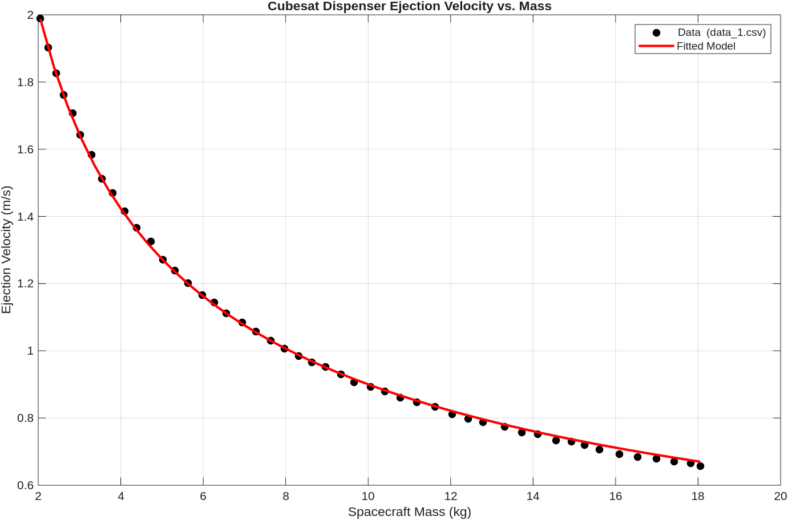
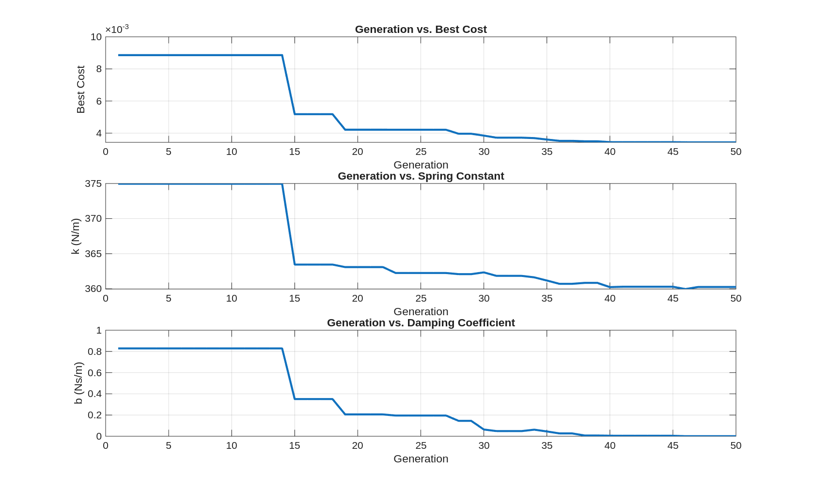

# Introduction {#sec-introduction}

The document contains the various solution methods for the GNC assignment problems. The given problems can be solved using more then one method, which author tried to implement. The document generated using [Quarto](https://quarto.org/docs/journals/) locally, created by the author. The source remains editable as a normal `.qmd` manuscript and the template can be found [here](https://github.com/kirancoder/paper_template/tree/main/sample_paper).


# Task 1 {#sec-task1}

This is a very intersting geometery problem, which can solved using trignometric relations to a triangles in a minor sector and also converting the problem in polar co-ordinates.

The 1st and formost the cone has to opened and converted into a sector of a circle, for a given right circular cone in the problem, it will always be a minor sector of a circle. For both the methods, minor sector will be used to find the downhill distance.

The 2nd catch is, when the cone is opened, the curve connecting point A and B will be stright line, which is the shortest distance between two points.

The below image shows the above discussed points, where the cone is opened and the curve connecting A and B is stright line.


::: {#fig-cone layout-ncol=2 fig-pos="H"}

{#fig-given-cone}

{#fig-opened-cone}

Given cone and its corresponding sector representation.

:::


## Solution 1 {#sec-task1-sol1}

In the given @fig-opened-cone, shows that the lengths of the given cone "p, q, r" relation to the various lenths of the minor sector.

Considering the person is going from the point A to B, the downhill distance will lie on the somewhere on the line connecting A and B. The distance can be calculated using trignometric relations to the triangle $\Delta \;ABO$ formed in the minor sector $OAA'$.

To define the uphill while moving on the line AB, one can imgaine moving closer to the point O, i.e. and then moving away from the point O, until reaching the point B. The divide the line segement AB into two parts, uphill and downhill, we a need a point of AB, which lies close to the point O, this can be found by draiwing a perpendicular from the point O to the line AB, which will intersect at a point D. The point D will be the closest point to O on the line AB, and hence the point D will be the point where the uphill ends and downhill starts.

The below image will show the point D in the $\Delta \;ABO$ triangle, which is the closest point to O on the line AB.

::: {#fig-cone layout-ncol=1 fig-pos="H"}

{#fig-opened-cone}

Representation of the uphill and downhill paths.

:::

So the task is now to find the distance DB, as the function of the given lengths p, q and r.

The $\Delta \; ABO$ the $\angle\; \theta$, is common between the $\Delta \; ABO$ and the sector. By the realtion between the angle and arc in circle, 
$$
\theta = \frac{l}{r}
$$ {#eq-r_theta} 

where $l = \overset{\frown}{AB}$ and $r$ is radius and $\theta$ is angle suspended by the sector.

The lengths $q$ which is the radius of the cone, the permeter of the sector can derivied from that, 
$$
\overset{\frown}{AB} = 2\, \pi \, q
$$ {#eq-cone}

Now, substiting arc length relation into @eq-r_theta,

$$
\theta = \frac{2\, \pi \, q}{r}
$$

Hence, $\theta  = f(q,r)$.  

Now, in $\Delta AOB$, and $\theta$ and two sides ($OA = r$ & $OB = r - p$) known in terms of the known quantites, so we can now apply $cosine$ rule to find the third side, $AB$ in terms of given parameters $p, \; q \& r$

$$
{AB}^2 = {OA}^2 + {OB}^2 - 2 \cdot OA \cdot OB \; cos(\theta) = r^2+(r-p)^2-2r(r-p)\cos\theta
$$ {#eq-cosine}

Consider $AB = k$

$$
k = \sqrt{r^2+(r-p)^2-2r(r-p)\cos\theta}
$$

Now, for the $\Delta AOD$ and $\Delta DOB$ are right angle triangles, the side $OD$:
$$
\begin{aligned}
OD^2 = OA^2 - AD^2 \quad \text{in } \Delta AOD \\
OD^2 = OB^2 - BD^2 \quad \text{in } \Delta DOB
\end{aligned}
$$ {#eq-tri-rel}

For simiplification consider $AD = m \; \text{and} \; DB = n$ which is line $AB$ defined above, then from @eq-tri-rel
$$
r^2 - m^2 = (r-p)^2 - n^2
$$

here $m$ is uphill distance and $n$ is downhill distance and simplifying the above solution gives,
$$
\begin{aligned}
m^2 - n^2 = r^2 - (r-p)^2 \\
(m+n)(m-n) = r^2 - (r-p)^2
\end{aligned}
$$ {#eq-main}

then, 

$$
m-n = \frac{r^2 - (r-p)^2}{m+n} = \frac{r^2 - (r-p)^2}{k} 
$$ {#eq-main-2}

and from the relations of $k, m \; \text{and} \; n$,
$$
m + n = k
$$ {#eq-main-1}

Now, substract @eq-main-2 from @eq-main-1 gives

$$
\begin{aligned}
2n = \frac{k^2 - r^2 + (r-p)^2}{k}
\end{aligned}
$$ 

Substitute the value of $k$ and simplify,

$$
\begin{aligned}
n = \frac{(r-p)^2 - r(r-p) cos(\theta)}{\sqrt{r^2+(r-p)^2-2r(r-p)\cos\theta}}
\end{aligned}
$$ 

So, the downhill distance ($n$), is the function $p, q, \text{and} r$ as $\theta$ is also function of $p, q, \; \text{and} \; r$

$$
n = g(p, q, r)
$$

This can also be solved using polar co-oridnates ($r \; \text{and} \; \theta$) and minimum distance and other required relations formed in that form.  


\pagebreak 

# Task 2 {#sec-task2}

This task is about the parameters estimation of the spring-mass-damper system, for the given mass and velocity data. This can be posed as a optimization problem, such that design varibles are damping and spring coefficients and the obejective function as $\Delta V$, i.e. the difference between simulation and given data, with the constraints as $2^{nd}$ order dynamics of the system.

## Solution Method

As per the problem statement, the same spring is used i.e. which expands the same length which is $0.15 \; m$ every time.

Let's consider the states of the system, position and velocity at $t_0$, which are $[-0.15, 0.0]$. The positon is initially taken as negative, because at final time the body is experiences only zero spring force $F(t_f) = kx =0$, as $k$ can't be zero, we conclude that $x(t_f)=0$.

The final states are, $[0.0, v_{data}]$.

$$
\dot{x}_1 = x_2
$$ {#eq-x1}

$$
\dot{x}_2 = -\frac{b}{m}x_2 - \frac{k}{m}x_1
$$ {#eq-x2}

Initial Conditions:

$$
x_1(t_0) = -0.15
$$ {#eq-bc-x1}

$$
x_2(t_0) = 0.0
$$ {#eq-bc-x2}

Final Conditions:

$$
x_1(t_f) = 0.0
$$ {#eq-bc1-x1}

$$
x_2(t_f) = \mathrm{data}
$$ {#eq-bc1-x2}

```{=latex}
\begin{center}
\begin{tikzpicture}[
    node distance=1.2cm and 0.55cm,
    scale=1.0,
    transform shape,
    startstop/.style={
        rectangle,
        rounded corners,
        minimum width=2.2cm,
        minimum height=0.9cm,
        text centered,
        draw=black,
        fill=gray!15,
        font=\bfseries
    },
    process/.style={
        rectangle,
        minimum width=3.25cm,
        minimum height=1.0cm,
        text centered,
        text width=3.25cm,
        draw=black,
        fill=blue!10
    },
    decision/.style={
        diamond,
        aspect=1.8,
        minimum width=2.7cm,
        minimum height=1.1cm,
        text centered,
        text width=2.7cm,
        draw=black,
        fill=yellow!20,
        inner sep=0pt
    },
    arrow/.style={
        thick,
        ->,
        >=stealth
    }
]
% TOP ROW
\node (start) [startstop] {Start};
\node (init) [process, right=of start] {1. Load Data \\ \& Set $(k_0,b_0)$};
\node (opt) [process, right=of init] {2. Proposal \\ Candidate $(k,b)$};
\node (sim) [process, right=of opt] {3. Physics Sim \\ Solve ODE};
% BOTTOM ROW
\node (cost) [process, below=1.4cm of sim] {4. Cost Eval \\ Calculate $SSE$};
\node (check) [decision, below=1.4cm of opt] {Converged? \\ ($SSE < \mathrm{Tol}$)};
\node (out) [process, below=1.4cm of init] {5. Display Optimal \\ $(k,b)$ \& Plot};
\node (stop) [startstop, below=1.4cm of start] {End};
% TOP ROW ARROWS
\draw [arrow] (start.east) -- (init.west);
\draw [arrow] (init.east) -- (opt.west);
\draw [arrow] (opt.east) -- (sim.west);
% SIMULATION TO COST
\draw [arrow] (sim.south) -- (cost.north);
% BOTTOM ROW ARROWS
\draw [arrow] (cost.west) -- (check.east);
\draw [arrow] (check.west) -- node[above, xshift=0.25cm, font=\small\bfseries] {Yes} (out.east);
\draw [arrow] (out.west) -- (stop.east);
% FEEDBACK ARROW
\draw [arrow] (check.north) -- node[right, font=\small\bfseries] {No (Update $k,b$)} (opt.south);
\end{tikzpicture}
\end{center}
```

Below, the proper optimization problem is formulated:

$$
J(k, b) = \sum_{i=1}^{N} (v_{sim, i}(m_i, k, b) - v_{data, i})^2
$$

with the non-linear constriants as the dynamics model of the system given in the @eq-x1 and @eq-x2, with the boundary constrains @eq-bc-x1, @eq-bc-x2, @eq-bc1-x1 and @eq-bc1-x2. 


This can be solved using different methods to find global optimal solution, but as per the authors best of knowledge, evoluctionary algorithums are prefered for the parameters estimation. In this case, @storn1997differential, simple and first strategy, $DE / \text{rand} / 1$ is implemented in this with the hyperparameters given below:

| Parameter | Symbol | Value | Description |
|:----------|:------:|------:|:------------|
| Population size | \(NP\) | 10 | Number of individuals in the population |
| Maximum generations | \(MaxGen\) | 50 | Number of generations |
| Mutation factor | \(F\) | 0.8 | Differential weight |
| Crossover rate | \(CR\) | 0.9 | Probability of crossover |
| Number of parameters | \(D\) | 2 | Number of optimization parameters |

: Differential Evolution hyperparameters. {#tbl-de-hyperparameters}


The optimization parameters $k$ and $b$, the lower and upper bounds are defined as

$$
\begin{aligned}
10 &\leq k \leq 1000,\\
0 &\leq b \leq 50.
\end{aligned}
$$ {#eq-parameter-bounds}


A simple *RK4* integrater is built to integrate the both the equations simulationally, from the given initial state to the final condition, $x_2(t_f) = 0.0$, but it was observed that, for few combinations of the $k$ and $b$ takes the longer time, mainly due to higher $b$, took too long to resolve or never reached separation.

TO fix this, author added the maximum limit of the $t_f = 10s$, which is added in the *RK4* loop such that If the simulation successfully reaches $x_1(t_f) \ge 0$ within this limit, it sets a success flag to True and outputs the final velocity $x_2(t_f)$, if it hits the time limit without separating, it sets the success flag to False and outputs $x_2(t_f) = \text{NaN}$, which penalizes that candidate in the optimizer.

::: {#fig-mass-vel layout-ncol=1 fig-pos="H"}

{#fig-mass-vel}

Mass vs Veclocity: Simulated  Curve and Given data 

:::


The MATLAB output is given below:

```text
Generation 46/50 | Best Cost = 0.003424 | k = 360.2204 | b = 0.0000
Generation 47/50 started...
Generation 47/50 | Best Cost = 0.003424 | k = 360.2204 | b = 0.0000
Generation 48/50 started...
Generation 48/50 | Best Cost = 0.003424 | k = 360.2204 | b = 0.0000
Generation 49/50 started...
Generation 49/50 | Best Cost = 0.003424 | k = 360.2204 | b = 0.0000
Generation 50/50 started...
Generation 50/50 | Best Cost = 0.003424 | k = 360.2204 | b = 0.0000

 DE Optimization Complete
Best Cost                    : 0.0034241292
Estimated Spring Constant k  : 360.220434 N/m
Estimated Damping Coefficient b : 0.000020 Ns/m
```
From the above results, it can be seen that the estimated damping coefficent is almost zero, $b = 0.000020\ \mathrm{Ns/m}$. This shows that the damping effect in the system is very small and can be neglected. Hence, the system mainly behaves like a spring-mass system, with the estimated spring constant of $k = 360.220434\ \mathrm{N/m}$. The simulated results obtained from these parameters are compared with the given data in @fig-mass-vel.

> Note: The optimized vriables and coast may differ at the runtime as it depends on the *rand* function, but $k$ will remain close to $360.0$ and the $b$ will remain close to $0$. 

The objective function can be even reduced by running it for more generation or the adding the tolerenace limit on the objective function. The author belives that, it will lead to the cost function to zero and the $k = 360 \; and \; b = 0.0$. 


::: {#fig-obj-kb layout-ncol=1 fig-pos="H"}

{#fig-obj-kb}

Generation vs Coast, k and b

:::


\pagebreak

# References


